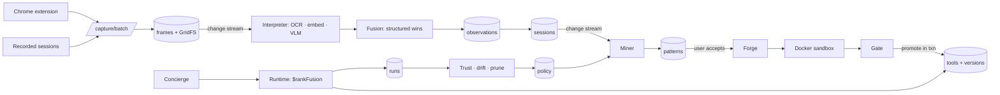
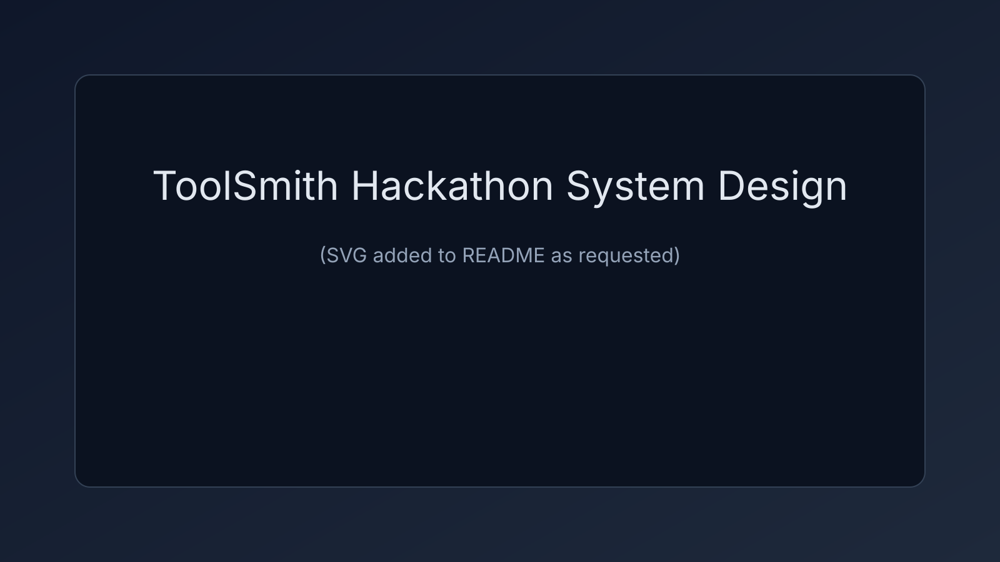

# ToolSmith

**Procedural memory for agents, on MongoDB Atlas.** ToolSmith watches how you and your agents work, on screen and in the logs. It spots the workflows you keep repeating and compiles them into tested, reusable tools, each with a one-page tutorial. Each tool gets more freedom only as it proves itself, and ToolSmith rewrites its own guardrails based on what happens.

> Built in one day at the MongoDB Recursive Harnessing hackathon (26 Sep 2026) by a team of three.

## The problem

People and agents repeat multi-step work every week: clean a spreadsheet and build a dashboard, scrape a site and report on it, read a paper and reproduce a result. Every repeat costs full time, tokens and attention, and nothing learned carries over between runs. Memory systems remember *advice*. ToolSmith remembers *capability*: it turns repetition into tools that run in seconds.

## What it does

```
observe → detect → recheck → propose → forge → gate → approve → reuse → learn → heal / prune → retune policy
```

1. **Observe.** A Chrome extension records clicks, form submits, navigation and keyframes on allow-listed sites. Pre-recorded desktop sessions (Excel) go through the same interpreter: OCR, multimodal embeddings, then a vision model that labels each step.
2. **Detect.** Steps get canonical signatures (`table.pivot:2col`, not "clicked in Excel"). A PrefixSpan miner finds repeated sequences, and scoring plus hard gates reject one-day bursts and high-variance noise.
3. **Forge and gate.** An accepted suggestion becomes a spec, code, tests and a tutorial. The tool runs in a network-less Docker sandbox and must pass unit tests, a replay on past runs, a side-effect check and dedupe before it can be promoted, in one transaction.
4. **Reuse.** A request is routed by hybrid search: *found* → working memory → tool run, or *not found* → agent. A live race shows the difference.
5. **Learn.** Tools climb a trust ladder (`dry_run → supervised → autonomous`), drop a level on failure, heal when a site changes, and get pruned when idle. The policy learner rewrites thresholds from feedback. Loosening always waits for the user.

## Architecture




Every arrow is a MongoDB collection or a change stream. **Atlas is both the control plane and the event bus**: work is queued in a `jobs` collection and picked up by the worker through change streams. There is no Kafka, Redis or Celery.

### Atlas feature map

| Atlas feature | Where ToolSmith uses it |
|---|---|
| Time-series collections | `observations`: high-volume raw activity with automatic expiry |
| Vector Search | `tools_vec`, `sessions_vec`: "have I seen this tool / episode before?" |
| `$rankFusion` + Atlas Search | Hybrid tool lookup: meaning *and* exact names |
| Change streams | `sessions`, `frames`, `jobs`, `events` → worker and live UI (SSE) |
| Multi-document transactions | Tool promotion: version, pointer, verdict and pattern status, all or nothing |
| TTL indexes | `observations` 60 d, `frames` 7 d, `working_memory` 2 h |
| GridFS | Screen keyframes stored next to their metadata |
| `$graphLookup` | Tools built from tools; prune never removes a tool another one depends on |

## Repository layout

| Path | What | Owner |
|---|---|---|
| `backend/app/` | FastAPI API: ingest, capture, miner, search, runtime, policy (P1); LLM client, forge, gate, sandbox, trust, interpreter, race (P2); concierge and ideas (P3) | all |
| `backend/worker.py` | Job worker (change streams) | P1 |
| `web/` | Next.js UI: tool shop, suggestions, chat, policy and metrics, capture, demo controls | P3 |
| `extension/` | Chrome MV3 recorder | P3 |
| `mocksite/` | "PriceWatch" demo site, layouts v1/v2, for the heal demo | P3 |
| `sandbox/` | Tool sandbox image | P2 |
| `scripts/` | `init_db`, `seed`, `search_indexes`, `precompute`, `video_to_frames`, `demo_reset` | P1/P2/P3 |
| `docs/TASKS.md`, `docs/plan_final.md` | Task board and design plan | team |

## Running it

**Requirements:** Python 3.11+, Node 20+, Docker, a MongoDB Atlas cluster (8.0+), an OpenRouter or OpenAI key, and a Voyage AI key for embeddings.

```sh
cp .env.example .env        # fill MONGODB_URI, OPENROUTER_API_KEY (or OPENAI_API_KEY), VOYAGE_API_KEY, LLM_*_MODEL
python -m pip install -r backend/requirements/dev.txt -r backend/requirements/p2.txt -r backend/requirements/p3.txt
python scripts/init_db.py               # collections, TTLs, indexes, action vocabulary (idempotent)
python scripts/search_indexes.py --apply
```

**Backend and mock site (Docker):**

```sh
docker compose --profile frontend up api worker mocksite    # API :8000, mock site :8081
```

**Web UI:**

```sh
cd web && npm install && npm run dev                        # http://localhost:3000
```

The UI runs on bundled mock data by default (`NEXT_PUBLIC_USE_MOCKS=true`). Switch to the live API with the "Use mock data" toggle in the sidebar or `NEXT_PUBLIC_USE_MOCKS=false`.

**Chrome extension:**

```sh
cd extension && npm install && npm run build
```

1. Open `chrome://extensions`, turn on **Developer mode**, click **Load unpacked** and pick the `extension/` folder.
2. Open http://localhost:8081, click the **ToolSmith** toolbar icon, then **Start recording**. Screenshots need that one click: it grants Chrome's `activeTab` permission, which lasts while you stay on the site.

**Reset the demo to its starting screen:**

```sh
python scripts/demo_reset.py            # init, seed, frames, cached generations, mock site v1, freeze vocab
```

### Tests

```sh
python -m pytest -q                     # backend (P1, P2, P3)
cd web && npm run lint && npm run typecheck && npm run smoke    # smoke needs `npm run dev` running
cd extension && npm test && npm run e2e                         # e2e needs the API and mock site
```

## Privacy controls

- **Allow-list only.** The extension has host permission for allow-listed origins only (the mock site on demo day). Other sites are never seen.
- **Dropped on the device:** password and card fields (no frame, no event), typed text (only its length is kept), URL query strings and ids.
- **Budgets:** at most 1 frame per second and 300 per 30 minutes; heartbeat frames are dropped first.
- **Pause and delete:** pause from the extension or the Capture page (the extension polls every 2 s), and delete the last 5 minutes.
- **Expiry by the database:** frames expire after 7 days and raw observations after 60, via TTL indexes.
- **Nothing is built, granted permissions, loosened or made autonomous without the user's approval.**

## Built today vs dependencies

**Built today:** everything in this repository: extension, mock site, UI, API, miner, forge, gate, sandbox runner, trust ladder, heal, prune, concierge and scripts.

**Dependencies:** MongoDB Atlas (Vector Search, Atlas Search, change streams, time-series, GridFS), Voyage AI embeddings, LLMs via LiteLLM and OpenRouter, FastAPI, Pydantic, Next.js, Tailwind, shadcn/ui, Recharts, RapidOCR, OpenCV, imagehash, ffmpeg, Docker.

**Partner stack:** MongoDB Atlas, OpenRouter, Voyage AI.

## Status (update before submitting)

| Area | State |
|---|---|
| Extension capture → `/capture/batch`, mock site v1/v2, full UI | working (UI also runs on bundled mock data) |
| Forge, gate, sandbox, trust ladder, heal, prune, race, concierge, ideas | working with live LLM calls; need Atlas + `VOYAGE_API_KEY` for search-backed steps |
| Atlas setup (collections, TTLs, change streams, GridFS, `$rankFusion`) | verified live |
| Suggestion accept/decline routes, live runtime, policy learner, real worker | in progress (P1) |
