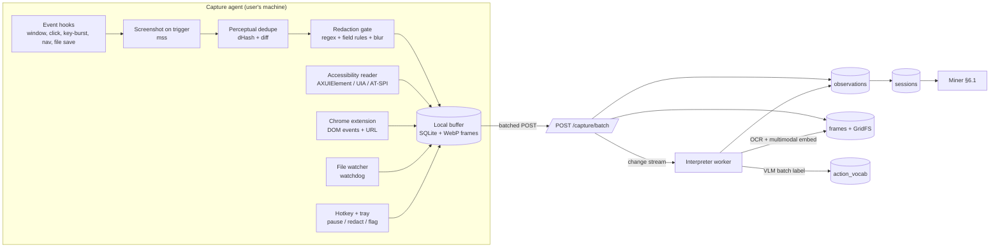

# ToolSmith — M1 Pattern Recognition with Screen Capture

*Implementation plan for observing the user's screen and activity, not just logs.*

Slots into `plan_final.md` §6.1 (M1 miner) and extends the ingest contract in `TASKS.md` §3.3. Everything here feeds the same `observations` → `sessions` → `patterns` pipeline you already have; nothing downstream changes.

---

## 0. The one design decision that matters

**Pixels are the last resort, not the first.** A screen recording is the *richest* signal and the *worst* representation. Three tiers, always tried in this order:

| Tier | Source | Fidelity | Cost | Use for |
| --- | --- | --- | --- | --- |
| **T0 — Structured** | App logs, connectors, file-system watcher, shell history, concierge chat | Exact (IDs, paths, params) | ~0 | Anything available this way. Always preferred. |
| **T1 — Semantic UI** | Browser extension (DOM events, URL, form fields), OS accessibility tree (window title, focused element, control names) | High: real element names and values | Low | Web apps and native apps that expose accessibility |
| **T2 — Pixels** | Screenshots → OCR → multimodal embedding → VLM labeling | Lossy, needs inference | High | Apps with no API and no accessibility (Excel dialogs, legacy desktop, Citrix, PDFs) |

A step captured at T1 gives you `sheets.pivot:{rows:Region, values:Sales}`. The same step captured at T2 gives you "the user probably made a pivot table." The first can be replayed and gated; the second can only be guessed at. So the capture agent runs **all three simultaneously** and fuses them per step, with T2 filling gaps rather than driving.

**Corollary that shapes the whole design:** observation modality ≠ execution modality. You may observe someone clicking in Excel, but the forged tool should execute via `openpyxl`/`pandas`, not by replaying clicks. §6 covers that bridge, and it's the part most teams get wrong.

---

## 1. Architecture of the capture layer



Three processes: the **agent** (local, cross-platform Python), the **ingest API** (existing), and the **interpreter worker** (new; batch OCR/VLM labeling). The interpreter is triggered by a change stream on `frames`, exactly like the rest of your system.

---

## 2. What triggers a capture

Never capture on a fixed timer alone. Timer-only capture produces 90% useless frames and misses the moment that matters (the click that changed state).

**Trigger table:**

| Trigger | Source | Captures |
| --- | --- | --- |
| Foreground window / app change | OS hook | Frame + window title + app bundle id |
| Click or Enter key | Input hook (no keystroke content) | Frame *before* and ~400 ms *after* — the after-frame shows the effect |
| Key burst ends (>800 ms idle after typing) | Input hook | Frame + target field name from accessibility |
| Browser navigation / SPA route change | Extension | URL, title, DOM diff summary (no frame needed) |
| File created / modified in watched dirs | watchdog | Path, extension, size delta |
| Clipboard copy of >20 chars | OS hook | Content hash + shape only, not content |
| Heartbeat while active | Timer, 5 s, only if input in last 30 s | Frame (cheap safety net) |
| Explicit user flag ("remember this") | Hotkey | Frame + prompt for one-line intent |

**Rate limits:** max 1 frame/second; max 300 frames per 30-minute session (the agent drops heartbeat frames first when over budget).

---

## 3. From frames to steps (the interpreter)

The expensive part is model inference, so the pipeline is a funnel: cheap filters first, VLM last, on as few frames as possible.

### 3.1 Stage A — local, free

1. **Perceptual dedupe.** `dHash` (64-bit) per frame; drop if Hamming distance ≤ 6 from the previous kept frame. Typical reduction: ~1,800 raw frames/hour → ~120 keyframes.
2. **Region diff.** Compare against the last kept frame of the same window; if the changed area is <2% of pixels and the title is unchanged, drop.
3. **Downscale + encode.** Longest edge 1280 px, WebP q=70 → ~80–150 KB/frame. Keep a 256 px thumbnail for the UI.
4. **Redaction (before anything leaves the machine).** See §5.

### 3.2 Stage B — cheap inference, local

5. **OCR.** RapidOCR (ONNX, Apache-2.0) or macOS Vision via pyobjc, ~50–150 ms/frame on CPU. Store text with bounding boxes. This is what makes screens searchable.
6. **Structured hints from OCR + accessibility:** window title, active document name, visible column headers, sheet/tab names, dialog titles, button labels near the click point.
7. **Click-target resolution:** intersect the click coordinates with accessibility elements or OCR boxes → "clicked button labeled *Insert PivotTable*". This single feature removes most of the need for a VLM.

### 3.3 Stage C — model inference, batched

8. **Multimodal embedding** of each keyframe (image + OCR text) using Voyage multimodal embeddings, stored on the frame document. Two uses:
   - **Screen-similarity matching:** `$vectorSearch` against past labeled frames. If the nearest neighbour is ≥ 0.93 similar and already labeled, **copy its label and skip the VLM entirely.** After the first day, this handles the majority of frames.
   - Grouping repeated screens inside the miner without any text at all.
9. **VLM labeling, batched per segment.** Send 6–10 keyframes of one segment in a single call with the OCR text and accessibility hints, and demand strict JSON:

```json
{"steps":[
  {"frame_id":"f_101","app":"excel","action":"open_file",
   "target":{"kind":"file","name":"sales_q3.xlsx"},
   "args_shape":{"ext":"xlsx"},"confidence":0.93},
  {"frame_id":"f_104","app":"excel","action":"pivot",
   "target":{"kind":"range","name":"A1:F220"},
   "args_shape":{"rows":"Region","values":"Sales"},"confidence":0.81}
]}
```

Rules for this call: the model may only choose an `action` from the current vocabulary or return `action:"other"` with a proposed verb; it must cite the `frame_id` for each step; low confidence (<0.6) marks the step `needs_review` rather than guessing.

### 3.4 Stage D — canonicalization

10. **Action vocabulary.** New verbs proposed by the VLM go to `action_vocab` as candidates. Embed the verb + example context; if cosine ≥ 0.88 to an existing verb, alias it; otherwise promote it after it appears 3 times. This keeps signatures stable, which is what the miner depends on — an unstable vocabulary silently destroys pattern support counts.
11. **Signature emission** in your existing format: `source.action:argshape`, e.g. `excel.pivot:2col`, `web.fetch:html`, `sheets.append_row:5col`.
12. **Fusion.** If T0/T1 produced a step for the same moment (±1.5 s), the structured version wins and the frame is attached as *evidence*. Screens never overwrite exact data.

---

## 4. Data model additions

Only additive — nothing in your existing collections changes shape.

```js
// frames  (metadata only; image bytes in GridFS)
{ _id: "f_104", user_id, session_id, ts,
  app: "excel", window_title: "sales_q3.xlsx — Excel",
  url: null, trigger: "click",
  dhash: "9f3c…", gridfs_id: ObjectId(), thumb_id: ObjectId(),
  ocr: { text: "PivotTable Fields…", boxes: [...] },
  embedding: [/* voyage multimodal */],
  label: { action: "pivot", confidence: 0.81, source: "vlm" },  // or "nn_copy" | "accessibility"
  redactions: [{ kind: "email", box: [..] }],
  expires_at: ISODate()        // TTL: 7 days for frames, 60 days for metadata
}

// ui_events  (T1 stream, no image)
{ user_id, session_id, ts, source: "chrome", kind: "submit",
  url_template: "https://app.example.com/orders/:id",
  element: { role: "button", name: "Export CSV" },
  value_shape: { fields: 4, types: ["str","date","num","num"] } }

// action_vocab
{ _id: "excel.pivot", status: "active", aliases: ["make pivot","insert pivottable"],
  embedding: [...], seen: 27, first_seen: ISODate(), example_frames: ["f_104"] }

// observations  (existing — one field added)
{ …, evidence: { frame_ids: ["f_104"], ocr_snippet: "PivotTable Fields", tier: "T2" } }
```

**Indexes:** `frames` → `{user_id:1, session_id:1, ts:1}`, TTL on `expires_at`, vector index on `embedding` (filter `user_id`); `ui_events` → `{user_id:1, ts:-1}`, `{url_template:1}`; `action_vocab` → vector index on `embedding`, `{status:1}`.

**Note on index budget:** the Atlas sandbox tier limits the number of search indexes (P1.1.2 checks this). Frames-vector is the 4th or 5th index you'd want. If the tier caps you, skip `patterns_vec` and keep `frames_vec` — nearest-neighbour label copying saves more money than pattern vectors do.

---

## 5. Privacy and safety (non-negotiable, and a demo asset)

Screen capture is the most invasive thing in the product. Judges *will* ask. Build the controls and show them.

1. **Local-first.** OCR, dedupe and redaction run on the machine. Raw frames never leave unless the user enables cloud labeling; by default only the *derived* step JSON and OCR snippets are uploaded, with frames optional per app.
2. **App allow/deny list.** Deny by default for: password managers, banking domains, messaging apps, anything in an incognito window. The extension refuses to attach to denied origins.
3. **Secret detection before upload.** Regex for keys/tokens/emails/card numbers over OCR text, plus accessibility `AXSecureTextField` detection → frame dropped entirely, not redacted.
4. **Never store keystroke content.** Only burst timing, target field name and value *shape* (length, type, whether it looked like an email).
5. **Visible recorder state.** Tray icon + a persistent border tint while capturing; global hotkey to pause; "delete last 5 minutes" button.
6. **Retention.** Frames TTL 7 days, metadata 60 days, both enforced by Mongo TTL indexes rather than a cron job.
7. **Audit.** Every capture session writes `capture_sessions {started_at, ended_at, apps_seen, frames_kept, frames_dropped_by_rule}` so the user can see exactly what was observed.

---

## 6. The execution gap (the part that decides whether this works)

Observing a GUI tells you *what* happened, not *how to redo it*. When the Forge builds a tool from screen-derived patterns, it must choose an execution path, in this order:

| Path | When | Example |
| --- | --- | --- |
| **API / library** (preferred) | The app has a programmatic equivalent | Excel pivot observed → `pandas.pivot_table` + `openpyxl` write |
| **Browser automation** | Web app, steps captured at T1 with real selectors | Playwright script generated from recorded DOM events (role + accessible-name selectors, never XPath) |
| **CLI / file ops** | Files, conversions, scripts | `ffmpeg`, `pandoc`, `pdftotext` |
| **Assisted (human-in-the-loop)** | No API, no stable selectors | Tool prepares inputs and opens the app at the right place; user does the final click. Still saves most of the time. |
| **Refuse** | Destructive or unverifiable | Pattern marked `not_automatable` with the reason shown |

Each tool version records `derivation: {observed_tier, execution_path}`. That field is how the gate knows what to test: an API-path tool gets replay on real fixtures; a browser-path tool gets a Playwright run against a recorded page snapshot; an assisted tool gets only a dry-run check.

**Selector strategy for the browser path:** capture `role` + accessible name + nearest stable data attribute. Store 3 fallback selectors per element. When a run fails on selector miss, the heal loop re-resolves the element from the current DOM and writes v+1 — that's your self-healing story, and it's far more reliable than pixel-coordinate replay.

---

## 7. Cost and performance budget

For one active user over an 8-hour day, with the funnel above:

| Stage | Volume | Cost driver |
| --- | --- | --- |
| Raw triggers | ~2,000 frames | Local only |
| After dedupe + diff | ~150–250 keyframes | Local only |
| OCR | all keyframes | ~100 ms each, CPU |
| Multimodal embedding | all keyframes | ~250 embeddings/day |
| NN label copy | 60–80% of frames after day 1 | 1 vector query each |
| VLM labeling | ~40–80 frames, batched 8/call → 5–10 calls | The only significant model cost |
| Upload | ~20 MB/day if frames are synced; ~200 KB/day if metadata only | — |

Target: **under $0.50/user/day** at steady state. Track it — "cost to observe" versus "minutes saved" is a metric judges respect, and it's the honest counter to "isn't this expensive?"

---

## 8. How we know it works (evaluation)

Build this before you tune anything, or you'll be tuning blind.

1. **Ground-truth recording.** One 20-minute screen recording of the demo persona doing 3 workflows, hand-labeled with the true step sequence (~60 steps). Store as a fixture.
2. **Metrics:**
   - *Step detection recall* — true steps that produced an observation. Target ≥ 0.85.
   - *Signature precision* — detected steps whose canonical signature is correct. Target ≥ 0.80.
   - *Boundary accuracy* — segment boundaries within ±1 step of truth.
   - *Pattern recall* — of the 3 planted workflows, how many the miner finds with the right signature sequence. Target 3/3.
   - *Noise rate* — suggestions generated from non-repeating activity. Target 0 on the fixture.
3. **Ablation for the pitch:** run the miner on logs only vs logs + screen. Report the delta in patterns found. This single number justifies the whole capture layer, and it's the slide-free evidence for "why screen capture?"

---

## 9. Failure modes

| Failure | Symptom | Mitigation |
| --- | --- | --- |
| Vocabulary drift | Support counts collapse; nothing crosses `min_support` | Alias new verbs to existing ones at ≥0.88; freeze vocab during a demo |
| VLM hallucinated steps | Phantom patterns | Require a `frame_id` citation; drop steps with confidence <0.6; structured tiers always win fusion |
| Over-capture of idle time | Frames full of the same screen | dHash + region diff + heartbeat only when input is recent |
| Personally identifying content | Compliance problem | §5, with drop-not-redact for secret fields |
| Coordinate-replay brittleness | Tools break on any layout change | Never replay coordinates; API path first, role/name selectors second |
| Multi-monitor / retina scaling | Wrong click-target resolution | Capture per-display with its scale factor; store `display_id` and DPI on each frame |
| Permissions (macOS Screen Recording + Accessibility) | Agent silently captures black frames | Startup self-test that renders a known window and fails loudly with instructions |

---

## 10. Hackathon-day plan

### 10.1 Honest scoping

A cross-platform capture agent is not buildable in 6.5 hours alongside everything else. What *is* buildable, and enough for the demo:

- **P0 — Chrome extension (MV3)**: clicks, form submits, navigation, page titles, plus `chrome.tabs.captureVisibleTab` keyframes on trigger. Web is where the demo workflows live, selectors are real, and there are no OS permission prompts on stage.
- **P0 — Frame interpreter**: dedupe → OCR → embed → VLM batch label → signature. Works on frames from *any* source, including a pre-recorded video split into frames.
- **P0 — Pre-recorded desktop session**: record the Excel workflow before the event as a video; on the day, run it through the same interpreter live. The pipeline is real; only the capture is pre-made. Say that out loud.
- **P1 — Minimal desktop watcher** (macOS or Windows, whichever the demo laptop runs): `mss` screenshots + foreground window title + click hook via `pynput`. ~150 lines. Only if Phase 2 is on schedule.
- **⭐ Stretch** — accessibility tree reader, multi-display handling, local-only mode toggle.

### 10.2 Ownership and timing (fits your existing phases)

| Phase | Who | Tasks |
| --- | --- | --- |
| Phase 0 (10:30–10:50) | P1 | Add `frames`, `ui_events`, `action_vocab`, `capture_sessions` to `init_db.py`; add `evidence` to the observation contract; add `POST /capture/batch` stub |
| Phase 1 (10:50–12:15) | P4 | Chrome extension: event capture + keyframe + batched POST. Test on the demo web app |
| Phase 1 | P1 | Interpreter A-stage: dedupe, thumbnail, GridFS write, frame docs |
| I-1a (12:15–12:45) | P1+P4 | Extension → ingest → observations → sessions end to end |
| Phase 2 (12:45–14:00) | P4 | OCR + click-target resolution + VLM batch labeler with strict JSON; action_vocab upsert |
| Phase 2 | P1 | Fusion rules (T0/T1 beat T2), signature emission, miner unchanged |
| I-2 (14:00–14:30) | all | Screen-derived pattern reaches `GET /suggestions` — **go/no-go** |
| Phase 3 (14:30–15:15) | P4 | NN label-copy path (skip VLM), evaluation run on the ground-truth fixture, ablation number |
| Phase 3 | P3 | UI: evidence strip — the suggestion card shows the actual screenshots behind the pattern |
| I-3 (15:15–15:35) | all | Freeze |

**Cut order:** desktop watcher → OCR click-target resolution → NN label copy → frames in UI. **Never cut:** the evidence strip (it is the proof the system watched *you*), and the fusion rule that structured data wins.

### 10.3 What this adds to the demo

The evidence strip is the upgrade. Instead of "we mined your logs," the suggestion card shows three actual screenshots from Tuesday, Thursday and today, with the caption *"You did this 3 times — 9 minutes each."* That is visceral in a way log mining never is, and it takes P3 about 30 minutes to build.

New demo beat, 15 seconds, right before the forge: click **"Why this?"** → the card expands to the three dated screenshots with the detected step sequence under them. Then accept, and the rest of the flow runs as planned.

---

## 11. Open decisions

1. Which browser app hosts the demo workflow? It must be one you control, so you can break it live for the heal moment.
2. Frames synced to Atlas, or metadata-only with local frames? Syncing looks better in the UI and in Data Explorer; metadata-only is the stronger privacy story. Pick one and say why.
3. Is the demo laptop macOS? If so, Screen Recording and Accessibility permissions must be granted and tested *before* the event; the prompt appears at the worst possible moment otherwise.
4. Ground-truth fixture: 20 minutes of labeled recording is ~1 hour of work. Do it before the event, since labeling is data prep, not project code.
