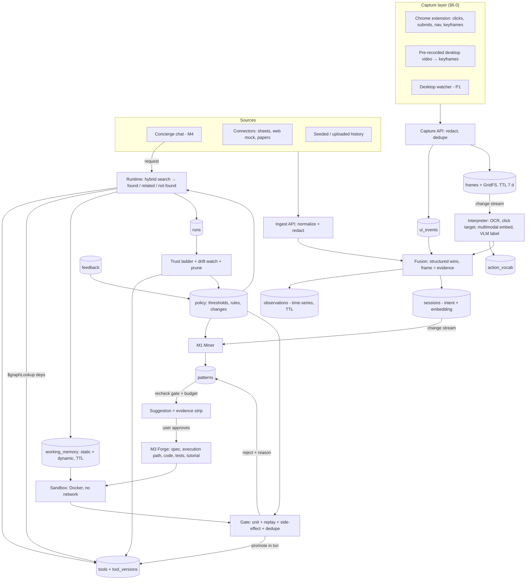
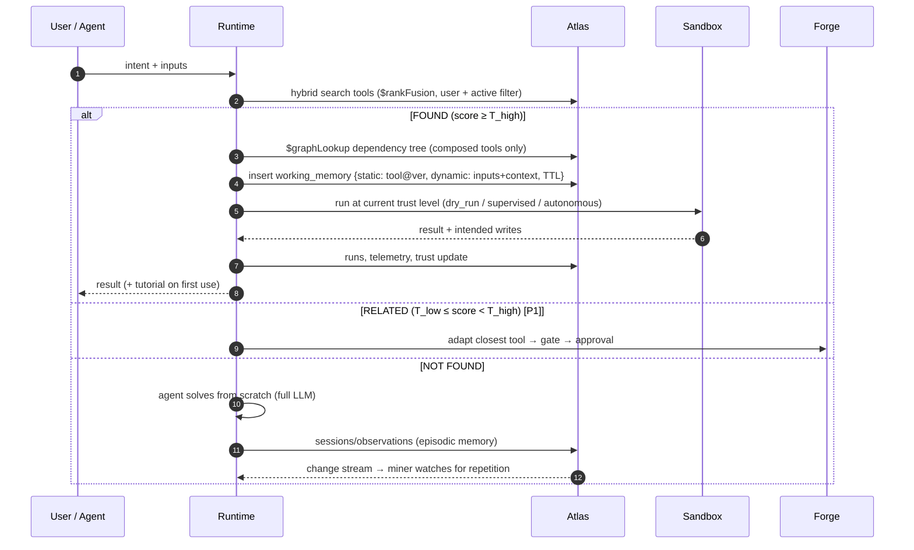

# ToolSmith — Final Plan v4 (v3 + screen-capture M1 + research notes)

> **One-liner:** ToolSmith is a *procedural memory layer for agents*. It watches how you and your agents work — **on screen and in the logs** — spots the workflows you keep repeating, compiles them into tested and reusable tools (each with a one-page tutorial), gives each tool more freedom only as it proves itself, and rewrites its own guardrails based on what happens.
>
> **Hackathon fit:** MongoDB Atlas is the control plane. Vector Search (hybrid, via `$rankFusion`, plus multimodal vectors on screen frames) decides "have I seen this before?", `$graphLookup` resolves tools built from other tools, and agentic memory is split into five tiers across Atlas collections. Two of the example themes are covered directly: *agents that rewrite their own guardrails* (policy strip) and *context held across weeks-long tasks* (episodic → procedural consolidation).

Status: **v4 (final)** · 25 Sep 2026 · Supersedes v3 (24 Sep), `m1-screen-capture-pattern-recognition.md`, and the Gemini research notes (`MongoDB_Recursive_Harnessing_Hackathon_Ideas.pdf`). `TASKS.md` needs the deltas listed in **§19** before the event.
Rule kept from the thought process: workflows come **only from Sections 2, 3 and 4**. Section 1 supplies the vocabulary and Section 5 supplies the pitch and metrics.

**What is new in v4, in one screen:**
1. **Screen-first capture layer (§6.0).** A Chrome extension and a frame interpreter turn clicks and screenshots into the same `observations → sessions → patterns` pipeline. Screen capture drives discovery and evidence; structured data still wins for exact step details.
2. **`$graphLookup` tool composition (§6.3.7).** Composed tools resolve their dependency tree in one query, and prune checks "who depends on me" before retiring a tool.
3. **The live race (§14).** A baseline agent solving from scratch runs side by side with the forged tool, so judges *see* the speed-up instead of hearing about it.
4. **Canonical signatures (§6.0.5).** Steps are named by what they do (`table.pivot:2col`), not by the app they were seen in, so a pivot done in Excel and one done in pandas count as the same step.
5. **A decision record for the research notes (§0.4)** and for the two screen-capture plans (§0.5): what we adopted, changed, and rejected, and why.

---

## 0. Review summary: what changed and why

### 0.1 Conflicts between plan1 and plan2, and how they were resolved

| # | Conflict | plan1 | plan2 | Final decision |
|---|---|---|---|---|
| C1 | Event format | 7-day build, Day-0 code spikes | 1 day (Sep 26, 10:30–17:00), **code must be written on the day** | **The 1-day schedule is the plan of record** (§13). Pre-event work is specs and prompts only, no code. ⚠ Confirm the rules: plan2 names "Problem Statement One (Recursive Harnessing)", but the topic you gave is "Atlas + Vector Search + Agentic Memory". The design fits both, and the pitch framing in §2 targets both. |
| C2 | UI | Next.js, with Streamlit as the alternative | Next.js, **Streamlit banned** | **Next.js is the main UI and Streamlit is the fallback.** Both are thin clients of the same FastAPI + SSE API, so switching costs nothing on the backend. Switch only at the 14:30 go/no-go if the Next.js UI is behind (§13.2). ⚠ Confirm the rules allow Streamlit (plan2 says it's banned). |
| C3 | Observation store | `trace_events` (TTL) + change stream | `observations` as a **time-series** collection + change stream | Keep time-series with `expireAfterSeconds`. **But:** time-series collections don't support change streams or Atlas Search/Vector indexes (verify on the day). So the ingest API upserts a regular `sessions` doc, and the **change stream plus vectors live on `sessions`/`patterns`/`tools`**, never on `observations`. plan2's diagram as drawn would not work. |
| C4 | Similarity decisions | Runtime found / related / not-found (T_high/T_low) plus forge-time merge / adapt / new | Only forge-time "cosine ≥ 0.90 → merge" | Keep **both** decision points, since they answer different questions (§7, §6.3). Thresholds are calibrated on labeled synthetic pairs, not guessed. |
| C5 | Autonomy | Approval matrix (static rules) | Trust ladder that **auto-promotes** to autonomous | Both, split by purpose: the **approval matrix** covers *structural* changes (build, install, permissions, merge, loosen). The **trust ladder** covers *run-time* autonomy. Promotion to `autonomous` is **proposed by the system and confirmed by the user**. plan2's auto-promotion broke its own rule that loosening needs approval. Demotion stays instant. |
| C6 | Self-modification | Guardrails as data (tighten automatically, loosen with approval) | L4 meta-policy thresholds with a `changes` log | **Unified into one `policy` document** with `thresholds`, `rules[]` and `changes[]`. Every change records `direction` (tighten/loosen), `origin` and `status`. One mechanism covers the "rewrites its own guardrails" pitch and the L4 loop. |
| C7 | Lifecycle vs trust | Lifecycle state machine | Trust levels | Two separate fields: `status` (candidate → active → deprecated / quarantined) and `trust` (dry_run → supervised → autonomous). |
| C8 | Scope and stack weight | hdbscan, Presidio, gVisor, canary shadowing, two MCP servers, LangGraph store, JWT auth | Lean: LiteLLM, custom PrefixSpan, single demo user | **Two tiers, used together.** The **Lean tier (plan2)** is the default for light tools and tasks. The **Heavy tier (plan1)** is used only when a task needs more tools or more reasoning. Routing is per task/tool, based on explicit criteria (§11.1). |
| C9 | Suggestion budget | 3 per week | N per day | `max_suggestions_per_day` (fits the compressed demo timeline). It is a field in `policy`, so L4 can tune it. |
| C10 | Tutorial | ≤ 350 words, 6 parts | 3 plain-language sections | 3 sections + a worked example + limits, **≤ 350 words**. Merged tools get a **merged tutorial** (plan2 had dropped this). |

### 0.2 Thought-process items that one or both plans missed

| Thought-process item | Gap | Fix in this plan |
|---|---|---|
| "Recheck before evaluations and suggestions" (M1) | Missing in plan2 | Recheck gate in §6.1 (P0) |
| "Semantic search, other search if needed" (M1) | Missing in plan2 | Hybrid `$rankFusion`, plus a structural signature query as fallback (§6.1.4) |
| "Identify 1 or more group of tasks, could be one after other" (M1) | plan2 covers it only indirectly via L2 composition | **Episode-chain mining** (§6.1 step 5c) produces *composed* tools (L2) |
| "Window frame, period" (S1) | plan2 uses only a session gap | Periodicity + burstiness score (§6.1.2). The **one-day-binge decoy** in the demo proves it works |
| "Similarity found → loop to temp storage memory / not found → create from scratch" (S3) | plan2 has no runtime reuse path or temporary storage | Runtime flow with `working_memory` (static + dynamic, TTL) (§7, P0) |
| M4 "User ideas analyze → loops to M3 on finalizing" | Thin in plan2 | `analyze_idea` flow (§6.4, P0 minimal) |
| "Dependency — user approval basis" | plan2 only has scopes | Approval matrix + dependency allow-list (§8.1) |
| "Merge tools + tutorial" | plan2 merges tools but not tutorials | Merged tutorial required; merged code must pass **both parents' replay fixtures** (§6.3.3) |
| Measurables: "memory comparisons" | plan2 has none | Memory-mode ablation (§15, P1-lite / P2-full) |

### 0.3 Things neither plan spelled out (new in v3)

1. **The synthetic generator must produce real artifacts, not just events.** Replay testing needs actual `.xlsx` inputs and expected outputs, HTML snapshots and paper text. Without them, the gate has nothing to replay (§13.1).
2. **Decoy patterns** in the synthetic history: a one-day binge and a high-variance workflow. Showing that ToolSmith *declines* to suggest them is 10 seconds of strong credibility (answers "mining looks trivial").
3. **A local mock site** (two layouts, v1 and v2) for the scrape/heal demo, so the live break is deterministic and doesn't depend on the real web.
4. **Episodic recall is visible:** "Why this suggestion?" runs `$vectorSearch` over `sessions` and cites the dated episodes. It shows judges vector search working as memory, not just as tool lookup.
5. **Consolidation ("sleep-time") job as a demo button** to show weeks of raw history compressing into episodes + profile facts + patterns. This is the "context across weeks" proof.
6. **Promotion runs in a multi-document transaction:** version insert + tool pointer + verdict + pattern status, all or nothing.

### 0.4 Research notes (PDF): what we adopted, changed and rejected

The Gemini research notes brainstormed ~50 ideas, picked ToolSmith (#143), and then sketched an architecture, a demo, a screen-capture plan and an open-source tool list. This table is the decision record for every idea in those notes that touches ToolSmith.

| # | Idea from the research notes | Decision | Where |
|---|---|---|---|
| R1 | "3-run magic trick": split screen, standard agent vs ToolSmith on the same task | **Adopt** as a demo beat: the baseline agent (our `not_found` path) races the forged tool live | §14 beat 4 |
| R2 | Fast-path semantic router: vector score ≥ 0.88 skips the planner; one small LLM call maps the request to tool arguments | **Adopt the shape** (it is our FOUND route). **Change:** keep calibrated `T_high` instead of a fixed 0.88, and add the argument-extraction call when a run starts from chat | §7 |
| R3 | Change stream counts an exact action-sequence hash; ≥ 3 repeats in 7 days → forge | **Adopt the trigger, reject the rule.** A raw hash count has no variance, burstiness, recheck or budget, so it would forge both planted decoys. Closing a session queues a mine job, and M1 decides | §6.1 |
| R4 | `$graphLookup` resolves tool-composition trees (Tool C → B → A) | **Adopt (new in v4).** **Fix:** the notes concatenate dependency code into one script, but every tool defines `run()`, so names clash. We mount dependencies as modules and call them through `ctx.call()`. Also add the reverse lookup for prune safety | §6.3.7 |
| R5 | Dual storage: dynamic/transient vs static/permanent | **Adopt as vocabulary** for the existing memory tiers; no new collections | §5 |
| R6 | `execution_traces` with a 14-day TTL | **Change:** raw observations keep 60 days (weekly and monthly rhythms need more than 14 days); screen frames keep 7 days | §5, §6.0.6 |
| R7 | E2B sandbox for generated code | **Heavy tier only.** Docker with no network stays the default | §11 |
| R8 | Auto-tutorial, dependency inspector, human approval gate, tool merging | Already in v3 | §6.3, §8 |
| R9 | Screen recording as the main pattern signal (frame capture, accessibility APIs, VLM + OCR, temporal fusion, Playwright/PyAutoGUI forge) | **Adopt**, reconciled with the M1 screen-capture doc (§0.5) | §6.0 |
| R10 | Open-source tools list (OmniParser, SPMF, PM4Py, cuML, FAISS, Temporal, …) | Adopt / defer / reject, one by one | §11.2 |
| R11 | Non-tech personas (HR, finance, e-commerce ops) and the LangSmith comparison | **Adopt** in framing and Q&A | §2, §17 |
| R12 | Cost, latency and storage numbers ($0.22 vs $0.0015 per run, 30 s vs 0.4 s, ~2.5 KB per step, ~15 KB per tool) | **Use as hypotheses only.** Replace with measured values from LiteLLM cost tracking and `collStats` | §15 |
| R13 | Patterns in past MongoDB hackathon winners: deep use of native features, real-time ingestion, structured context stored next to vectors | **Adopt** as an "Atlas feature map" for the pitch and README | §2.1 |
| R14 | The other ranked ideas (literature contradiction synthesizer, shell-company unmasker, …) | Out of scope. The paper workflow survives only as UC2 | §10 |

### 0.5 The two screen-capture plans, reconciled

The research notes and the M1 doc both describe screen capture, and they disagree on several points. One decision per point:

| Topic | Research notes | M1 doc | v4 decision |
|---|---|---|---|
| Role of the screen | Screen is the primary signal | Structured first, pixels last | **Capture all tiers at the same time.** The screen is always on and drives *discovery* (segmentation, recall, evidence). Structured data drives *replay* (exact step details). When both describe the same moment, structured wins and the frame is kept as evidence |
| Frame rate | 1–2 FPS buffer + event triggers | Trigger-only, ≤ 1 frame/s, 5 s heartbeat | Trigger-only, ≤ 1 frame/s (Chrome's `captureVisibleTab` is itself capped at 2 calls/s) |
| Dedupe | pHash, drop if > 95 % similar unless a click happened | dHash Hamming ≤ 6 + region diff < 2 % | dHash ≤ 6 + region diff. The **event** is always kept; the **frame** is kept only if the screen changed |
| Fusion window | ±200 ms | ±1.5 s | **±1.5 s** across tiers, because file saves and network logs lag the click. Event + frame pairs from the extension come from the same trigger and need no alignment |
| Sessionization | 20-min idle + 3-min app shift | Uses the plan's 30 min | 30-min idle (contract unchanged) + *(P1)* app-focus shift > 3 min to an app not seen in the segment, when intent cosine < 0.5 |
| Vision model | Florence-2 / Qwen2-VL-2B locally, OmniParser | OCR + click target first, batched API VLM, nearest-neighbour label copy | **M1 doc's funnel.** Local VLMs are ⭐ (no GPUs on the laptops, long setup) |
| OCR | PaddleOCR or Tesseract | RapidOCR | RapidOCR (PaddleOCR models on ONNX, plain `pip`), Tesseract as fallback |
| Embeddings | Voyage text centroid of visual + text summaries | Voyage multimodal per frame | **Both:** multimodal vectors on frames (`frames_vec`), text centroid on sessions (unchanged) |
| Forge target | Playwright or PyAutoGUI | API first → Playwright role selectors → assisted → refuse; never coordinates | **M1 doc.** PyAutoGUI is rejected for replay |
| Step names | `chrome.click:Export_Button` | `excel.pivot:2col` | **Canonical domain verbs** (`table.pivot:2col`); the app moves to `meta.source` (§6.0.5) |
| Owners | P1 most, P4 generator, P2 Playwright, P3 cards | P4 extension + OCR/VLM, P1 dedupe/fusion | **Rebalanced (§19):** P3 builds the extension (TypeScript), P4 the interpreter, P1 ingest + fusion, P2 the execution-path field |

---

## 1. Constraints & assumptions

| # | Assumption | If wrong |
|---|---|---|
| A1 | One-day build (10:30–17:00), team of 4, code written on the day | Solo/2 people: drop heal + UC2 + merge (§13.4) |
| A2 | One seeded demo user, but `user_id` on every doc and index filter | Already multi-tenant-ready |
| A3 | Python backend, Next.js frontend (Streamlit fallback) | — |
| A4 | Generated tools are Python functions + JSON-Schema params + `TOOL.md`, runnable in Docker, and optionally exposed over MCP | — |
| A5 | Nothing is built, installed, granted permissions, loosened, or made autonomous without user approval | §8 |
| A6 | "Weeks" of history = synthetic 2–3 week persona generated on the day, plus live events from the concierge **and the capture layer** | — |
| A7 | Screen capture on the day = Chrome extension on the mock site (live) + three pre-recorded Excel sessions replayed through the same interpreter. The desktop watcher is P1 | Only one OS on the demo laptop matters (§18) |
| A8 | Recording the Excel videos and hand-labeling the ground-truth fixture happen **before** the event. That is data prep, not project code | If the rules forbid it, record during 10:30–11:00 and label only 10 minutes |

---

## 2. Product definition & framing

**Problem.** People and agents repeat multi-step work every week: clean a spreadsheet and build a dashboard, read a paper and reproduce a simulation, scrape and analyze. Each repeat costs full tokens, time and attention, and nothing learned carries over between runs.

**Solution.** A harness around the agent that turns repetition into verified capability:
observe → detect → recheck → propose → forge → gate → approve → reuse → learn → heal / merge / prune → retune policy.

**Who it's for.** People with recurring, multi-step, semi-structured work who won't write automation themselves: analysts, researchers, ops staff, founders, and daily agent users.

**Framing for judges (why this counts as agent memory, not an app):**
- ToolSmith is **procedural memory that executes**. Memory systems like AWM remember *advice*; ToolSmith remembers *capability*.
- The thing being modified is the **agent's own environment**: its tool set, its permissions and its policy.
- It learns from **what you do on screen**, not only from what an agent logged, so it works for people who never touch an API.

**Non-tech personas for the pitch (R11).** These are told on stage, not built; UC1 is the one we build.

| Persona | What they repeat | What ToolSmith hands back |
|---|---|---|
| Financial analyst | Download bank CSVs, flag variances over $10k, convert currency, send a PDF | `monthly_variance_audit(files)`: drop files in, get the PDF |
| HR coordinator | Pull candidates, cross-check profiles, draft rejection emails, update the tracker | `candidate_batch_close(stage)` with an approval step before any email goes out |
| E-commerce ops lead | Check low stock, query vendors, draft purchase orders, post to Slack | `reorder_low_stock()` that stops at "Approve reorder" |

The common thread: the user never writes code. They get a suggestion with screenshots of their own work, a one-page tutorial, and a tool that asks before it acts.

### The four recursion loops (plus the two feedback loops from your thought process)

| Loop | What changes | Evidence | Thought-process link |
|---|---|---|---|
| L1 Capability | Tools created, improved, merged, pruned | Pattern support, run outcomes | "Self-improving; improve and merge tools" |
| L2 Composition | New tools built from existing tools / chained episodes | Episode-chain mining, call-graph reuse | "Group of tasks, one after other" |
| L3 Authority | Trust level of each tool | Success streak, edit rate, failures | "Dependency — user approval basis" |
| L4 Meta-policy / guardrails | Thresholds and rules that govern L1–L3 | Prune rate, rejections, false actions | "Take feedback and loop to module 1" |
| F1 M3 → M1 | Scoring weights, cooldowns, negative examples | Accept / reject / edit / ignore | Module 3 feedback loop |
| F2 M4 → M3 | What gets finalized and built | User ideas + chat feedback | Module 4 feedback loop |

### 2.1 Atlas feature map (R13)

Past MongoDB hackathon winners used native features deeply, ingested data in real time, and kept structured context next to their vectors. This is ToolSmith's map, used on one README section and one pitch sentence ("every arrow in our diagram is an Atlas feature").

| Atlas feature | Where ToolSmith uses it | Why it matters |
|---|---|---|
| Time-series collections | `observations` | Cheap, high-volume raw activity with automatic expiry |
| Vector Search | `tools_vec`, `sessions_vec`, `frames_vec` (multimodal), `patterns_vec` | "Have I seen this tool, episode or screen before?" |
| `$rankFusion` + Atlas Search | Hybrid tool lookup | Meaning *and* exact names/extensions in one query |
| Change streams | `sessions`, `jobs`, `runs`, `frames`, `events` → SSE | Atlas is the event bus; no Kafka or Redis |
| Multi-document transactions | Tool promotion | Version + pointer + verdict + pattern status, all or nothing |
| TTL indexes | `observations` (60 d), `frames` (7 d), `working_memory` (2 h) | Privacy and working memory enforced by the database |
| GridFS | Screen keyframes | Evidence screenshots stored beside their metadata |
| `$graphLookup` | Tool composition + prune safety | Tools built from tools, resolved in one query |

---

## 3. Traceability: thought process → mechanism

| Keyword (S1/S2) | Mechanism | § | Priority |
|---|---|---|---|
| Monitor execution traces | Source adapters → `observations` (time-series) + `sessions` | 6.1 | P0 |
| Detect repeating/recurring workflows | PrefixSpan over action signatures + intent clustering | 6.1 | P0 |
| Pattern recognition; keywords, features, characteristics | Signatures `source.action:argshape`, intent embeddings, static/dynamic split | 6.1 | P0 |
| Window frame, period | Distinct-days gate, periodicity, burstiness | 6.1.2 | P0 (simple) |
| Classify repetitive / non-repetitive | Support + variance + kNN neighbours → label | 6.1 | P0 |
| Recheck before suggestions | Recheck gate | 6.1.3 | P0 |
| Semantic search, other search if needed | `$rankFusion` (vector + text) → structural fallback | 6.1.4 | P0 |
| Group of tasks one after other | Episode-chain mining → composed tool | 6.1 / 6.3 | P1 |
| Storage (static + dynamic → temporary) | Memory tiers + `working_memory` TTL | 5 | P0 |
| 1-page tutorial | `TOOL.md`, ≤ 350 words | 6.3 | P0 |
| Merge tools + tutorial | Merge path with dual-fixture gate | 6.3.3 | P1 |
| User specific | `profile` facts + fitting to user's own episodes | 6.3.4 | P1 |
| Dependency | Manifest, allow-list, approval | 8.1 | P0 |
| Limit suggestions | Daily budget, cooldown, ranking | 6.3.6 | P0 |
| Feedback → M1 | `feedback` → re-weight + policy changes | 8.3 | P0 (reject path) |
| Chatbot: analyze ideas → M3 | Concierge `analyze_idea` → spec → forge | 6.4 | P0 (minimal) |
| Saves time / tokens | Before/after metrics, break-even | 15 | P0 |
| Capture patterns from the **screen and user activity**, not only logs | Chrome extension + frame interpreter + fusion (structured wins) | 6.0 | P0 |
| Tools that compose earlier tools | `$graphLookup` dependency tree + `ctx.call()` | 6.3.7 | P1 |
| Faster execution | FOUND route skips the planner; the live race shows it | 7, 14 | P0 |

---

## 4. System architecture



Reading the loop: screen + logs → fused observations → sessions → patterns → tools → runs → trust/drift → policy → back into mining. Every arrow is either a MongoDB collection or a change stream, so **Atlas is the control plane and the event bus.**

**Processes:** `api` (FastAPI, never executes tool code) · `worker` (asyncio, tails change streams on `sessions`, `jobs`, `runs`, **`frames`**) · `sandbox` (ephemeral Docker) · `web` (Next.js; Streamlit fallback on the same API) · **`extension`** (Chrome MV3, runs in the user's browser). The interpreter is a job handler inside `worker`, not a new service. No Kafka, Redis, Celery or Postgres.

---

## 5. Memory architecture on Atlas (M2)

| Tier | Holds | Collection(s) | Retention | Search |
|---|---|---|---|---|
| Working | Current run: static tool + dynamic args + scratch | `working_memory`, concierge `conversations` | TTL (2 h) | Key lookup |
| Episodic | What happened | `observations` (raw), `sessions` (summarized episodes) | Raw TTL 60 d; sessions kept | Vector on `sessions.intent_embedding` |
| Semantic | Stable facts about the user (column naming, chart style, folders) | `profile` | Long, with decay | Filter / text |
| Procedural *(core)* | How to do things | `patterns`, `tools`, `tool_versions` | Versioned, never deleted | Hybrid + optional rerank |
| Policy | Guardrails, thresholds, audit | `policy`, `feedback`, `verdicts` | Versioned | Filter |
| Episodic (screen) | What the screen showed, kept as evidence | `frames` (metadata + multimodal vector), `ui_events`; keyframes in GridFS | Frames 7 d; metadata 60 d | Vector on `frames.embedding` |

**Dynamic vs static storage (R5, the research notes' "dual storage"):** the *dynamic / transient* side is `observations`, `frames`, `ui_events`, `working_memory` and open `sessions`, all with TTLs. The *static / permanent* side is `tools`, `tool_versions`, `patterns`, `profile` and `policy`, versioned and never silently deleted. Consolidation and promotion are the only paths from one side to the other.

**Static vs dynamic (Section 3):** *static* = tool version, pattern, profile, policy. *Dynamic* = this run's inputs and context. *Temporary storage* = `working_memory`, one document that merges both for a run and expires by TTL.

**Consolidation job** (nightly; also a UI button for the demo, P1):
1. Summarize closed sessions → `intent_summary`, outcome, tokens, duration.
2. Promote repeated facts → `profile` (e.g. "renames columns to Title Case").
3. Decay salience of idle patterns and archive after N idle windows.
4. Re-mine the whole retained window to catch weekly/monthly rhythms that per-session mining misses.

This is how ToolSmith keeps **weeks of context** without stuffing it into prompts.

---

## 6. Modules

### 6.0 M1a — Capture layer (screen + user activity)

This is the front half of M1. It turns what the user *does* into the same `observations` the miner already reads, so nothing downstream changes shape.

#### 6.0.1 Three tiers, captured together

| Tier | Source | Fidelity | Cost | Role |
|---|---|---|---|---|
| **T0 — Structured** | App logs, connectors, file watcher, concierge chat | Exact (IDs, paths, params) | ~0 | Exact step details for replay |
| **T1 — Semantic UI** | Chrome extension (DOM events, URL, element role + name), *(⭐)* OS accessibility tree | High: real element names and value shapes | Low | Web workflows; real selectors for heal |
| **T2 — Pixels** | Keyframes → OCR → multimodal embedding → VLM label | Lossy, needs inference | Highest | Apps with no API and no accessibility (Excel dialogs, desktop tools); evidence for every step |

All three run at once. The screen is what makes ToolSmith notice work that never reached a log, and it is what the user sees as proof. But a step seen at T1 (`table.pivot {rows: Region, values: Sales}`) can be replayed and gated, while the same step seen only at T2 ("probably made a pivot") can only be guessed. So **fusion always prefers the structured version and keeps the frame as evidence.**

**Observation modality ≠ execution modality.** Watching someone click through Excel does not mean the tool should click through Excel. The forge picks an execution path separately (§6.3.8).

#### 6.0.2 Capture triggers (never a plain timer)

| Trigger | Source | Captures |
|---|---|---|
| App or tab change | Extension / OS hook | Frame + title + URL or app id |
| Click or Enter | Extension / input hook (no key content) | Event always; frame ~400 ms after (shows the effect) |
| Typing burst ends (> 800 ms idle) | Extension | Target field name + value *shape* (length, type), frame |
| Navigation / SPA route change | Extension | URL template, title, short DOM diff summary |
| File created or modified in watched folders | File watcher | Path, extension, size change |
| Heartbeat | Timer, 5 s, only if there was input in the last 30 s | Frame (cheap safety net) |
| "Remember this" hotkey | User | Frame + a one-line intent from the user |

Budget: at most 1 frame/s and 300 frames per 30-minute session; heartbeat frames are dropped first when over budget.

#### 6.0.3 Interpreter funnel (cheap first, VLM last)

| Stage | Steps | Tools |
|---|---|---|
| **A · local, free** | dHash per frame, drop if Hamming ≤ 6 from the last kept frame of the same window; drop if the changed region < 2 % and the title is unchanged; downscale to 1280 px WebP (q70) + 256 px thumbnail; redact (§6.0.6) | `imagehash`, OpenCV, Pillow |
| **B · cheap inference** | OCR with boxes; hints from title, sheet/tab names, column headers, dialog titles; **click-target resolution** (click point ∩ OCR box or DOM element → "clicked *Insert PivotTable*") | RapidOCR (Tesseract fallback) |
| **C · batched models** | Voyage **multimodal** embedding of image + OCR text → `frames.embedding`. **Nearest-neighbour label copy:** if a labeled frame is ≥ 0.93 similar, copy its label and skip the VLM. Otherwise send 6–10 keyframes of one segment in **one** VLM call with OCR text and hints; strict JSON | Voyage multimodal, `llm.complete(json_schema=…)` with a vision model |
| **D · canonicalize** | Map verbs to `action_vocab`, emit signatures, fuse with T0/T1 | §6.0.4, §6.0.5 |

VLM output contract (the model must cite a `frame_id` for every step, may only use known verbs or return `"other"` with a proposed verb, and marks anything below 0.6 confidence as `needs_review` instead of guessing):

```json
{"steps":[
  {"frame_id":"f_101","app":"excel","verb":"file.open","target":{"kind":"file","name":"sales_w1.xlsx"},
   "args_shape":{"ext":"xlsx"},"confidence":0.93},
  {"frame_id":"f_104","app":"excel","verb":"table.pivot","target":{"kind":"range","name":"A1:F220"},
   "args_shape":{"rows":"Region","values":"Sales"},"confidence":0.81}
]}
```

For the pre-recorded desktop sessions, `ffmpeg -vf "select='gt(scene,0.02)'"` turns each video into keyframes, which enter Stage A with `trigger: "video_replay"`. The pipeline is real; only the capture is pre-made, and we say so on stage.

#### 6.0.4 Fusion rule

1. T0/T1 and T2 steps within **±1.5 s** of each other describe the same moment. The structured step wins; the frame id goes into `observation.evidence`.
2. A T2-only step becomes an observation with `evidence.tier: "T2"` and its VLM confidence.
3. Screens never overwrite exact data, and `needs_review` steps never count toward pattern support until confirmed.

#### 6.0.5 Canonical signatures (contract change)

v3 used `source.action:argshape` (`sheets.read:xlsx`, `pandas.pivot:2col`). With screen capture, the same step now arrives from several sources: Excel via pixels, a web sheet via the extension, pandas via logs. If the signature carries the app name, support splits three ways and nothing crosses `min_support`.

v4 uses **`domain.verb:argshape`**, with the source kept in `meta.source`:

| Domain | Example verbs |
|---|---|
| `file` | `file.open:xlsx`, `file.save:html`, `file.download:csv` |
| `table` | `table.rename:cols`, `table.dropna`, `table.cast`, `table.pivot:2col`, `table.filter`, `table.join` |
| `chart` | `chart.bar`, `chart.line` |
| `web` | `web.navigate`, `web.fetch:html`, `web.extract:list`, `web.submit:form` |
| `doc` | `doc.read:pdf`, `doc.extract:params` |
| `export` / `msg` | `export.html`, `export.pdf`, `msg.send:email` |

`action_vocab` is seeded with ~30 verbs before the event (data, not code). New verbs proposed by the VLM are aliased to an existing verb when cosine ≥ 0.88, and otherwise promoted after 3 sightings. **Freeze the vocabulary during the demo**, because an unstable vocabulary silently destroys support counts. The UC1 fixture signature becomes `["file.open:xlsx","table.rename:cols","table.dropna","table.cast","table.pivot:2col","chart.bar","export.html"]`.

#### 6.0.6 Privacy controls (built, and shown on stage)

1. **Local first:** dedupe, OCR and redaction run before anything leaves the browser or laptop.
2. **Allow-list by default:** the extension only has host permission for allow-listed origins (the mock site on the day). Password managers, banking, messaging and incognito are never captured.
3. **Drop, don't blur, secrets:** key/token/email/card regex over OCR text, and password fields detected in the DOM → the whole frame is dropped.
4. **No keystroke content**, only timing, field name and value shape.
5. **Visible recorder:** toolbar badge + tray state, a pause hotkey, and a "delete last 5 minutes" button.
6. **Retention by TTL index:** frames 7 days, metadata 60 days.
7. **Audit:** `capture_sessions {started_at, ended_at, apps_seen, frames_kept, frames_dropped_by_rule}` so the user sees exactly what was watched.

**Sync decision:** thumbnails and keyframes are synced to Atlas **only for allow-listed demo sources** (the mock site and the pre-recorded Excel sessions), which is what the evidence strip needs. Everything else uploads derived steps and OCR snippets only. This gives the strong privacy story and the strong demo at once.

#### 6.0.7 Hackathon scope

| Priority | What | Why this and not more |
|---|---|---|
| **P0** | Chrome extension (MV3): clicks, submits, navigation, typing-burst ends, `captureVisibleTab` keyframes, batched POST | Demo workflows live on web pages we control; real selectors; no OS permission prompts on stage |
| **P0** | Interpreter Stages A–D on frames from any source | One pipeline for extension frames and video frames |
| **P0** | Three pre-recorded Excel sessions (UC1 weeks 1–3) replayed through the interpreter | Gives real screenshots for the evidence strip and a desktop story |
| **P0** | Evidence strip on the suggestion card | It is the proof that the system watched *you* |
| P1 | Nearest-neighbour label copy; app-shift segmentation; capture panel (pause, allow-list, delete last 5 min, audit) | Cost and trust, not core flow |
| P1 | Desktop watcher: `mss` screenshots + foreground window title + `pynput` click hook (~150 lines, demo OS only) | Only if Phase 2 is on time |
| ⭐ | OS accessibility reader, multi-monitor/DPI handling, local VLM (Florence-2 / Qwen2-VL), OmniParser | GPU and per-OS work |

#### 6.0.8 Cost budget (one user, 8-hour day)

~2,000 triggers → ~150–250 keyframes after dedupe → OCR on all (CPU, ~100 ms each) → ~250 multimodal embeddings → VLM on ~40–80 frames in 5–10 batched calls (after day 1, 60–80 % are label copies). Target **under $0.50 per user per day**, tracked as "cost to observe" next to "minutes saved" (§15).

### 6.1 M1b — Pattern recognition (`miner`)

| Step | What | How (hackathon version) |
|---|---|---|
| 1. Normalize + redact | Canonical event; strip secrets; keep argument **shapes** (types, column names, extensions). Screen-derived steps arrive already fused and redacted (§6.0.4, §6.0.6) | Regex rules for keys/emails/tokens |
| 2. Sessionize / segment | Split on a 30-min idle gap; *(P1)* also split when focus moves for > 3 min to an app not seen in the segment **and** intent cosine < 0.5 (screen signal) | Pandas |
| 3. Signatures | Canonical `domain.verb:argshape` from `action_vocab` (§6.0.5), e.g. `file.open:xlsx`, `table.pivot:2col`, `web.fetch:html`; the app stays in `meta.source` | Deterministic map for T0/T1; VLM label + vocab aliasing for T2 |
| 4. Classify | repetitive / non-repetitive / unknown from support, variance and number of `$vectorSearch` neighbours | Rules |
| 5a. Mine sequences | PrefixSpan, `min_support = policy.min_support`, len 3–8, max-gap constraint | `prefixspan` or ~80 lines of custom code |
| 5b. Cluster intents | Group paraphrases ("summarize these emails" ≈ "gist of my inbox") | Agglomerative clustering on Voyage embeddings, cosine threshold (sklearn) |
| 5c. Episode chains *(P1)* | Mine sequences *of pattern IDs* across consecutive sessions (scrape → analyze → report) | Same PrefixSpan over pattern IDs |
| 6. Static/dynamic split | Diff argument values across occurrences: varying → parameter, constant → default. For UI steps: element role + name that never change are static anchors; typed values, file names and URLs that change become parameters | Value diff + LLM names the parameters |
| 7. Window & period | distinct days, inter-arrival median/MAD, burstiness | numpy |
| 8. Score | §6.1.2 | — |
| 9. Recheck gate | §6.1.3 | — |

#### 6.1.2 Scoring (one formula, merged)

```
hard gates:  support ≥ policy.min_support (3)  AND  distinct_days ≥ 2
             AND variance < policy.max_variance (0.35)  AND  burstiness < 0.8

variance    = 1 − median pairwise sequence similarity across occurrences
confidence  = (1 − variance) × (0.5 + 0.5·periodicity) × recency_decay(half-life 14d)
value       = est_minutes_saved_per_week × confidence − risk_penalty(scopes, external writes)
```

Rank by `value`. Weights and gates live in `policy`, so feedback can move them.

#### 6.1.3 Recheck gate (before any suggestion)

A pattern becomes a suggestion only if **all** of these hold:
1. It is still detected in the latest window.
2. It isn't already covered: hybrid search over active `tools` is below `T_high`.
3. It isn't in cooldown after a reject or snooze.
4. The daily budget allows it.
5. No `policy.rules` entry blocks it (e.g. "never suggest anything touching /finance").

#### 6.1.4 Search strategy

Default is **hybrid**: `$rankFusion` over `$vectorSearch` (meaning) + `$search` (exact names, extensions, sources), filtered by `user_id` and `status`. For purely structural questions ("patterns using `table.pivot`"), use a plain indexed query on the `signature` array. Everything goes through one `search()` function, so fallbacks (client-side RRF, Voyage rerank API) can be swapped in without touching anything else.

#### 6.1.5 When mining runs (R3)

The research notes forge a tool as soon as an exact action hash repeats 3 times. We keep their change-stream trigger but not the rule: closing a session queues a `mine` job, and the full M1 path (signatures → PrefixSpan → variance, periodicity, burstiness → recheck → budget) decides. The raw hash rule has no variance or burstiness gate, so it would forge the one-day binge decoy, which is exactly what the demo shows ToolSmith refusing to do.

### 6.2 M2 — Storage

Covered in §5 and §9. Rules: vectors live **inside** the docs they describe (no sync job); every doc and vector index carries `user_id`; `tool_versions` are immutable and `tools` points to the active one; TTL on `observations` and `working_memory`.

### 6.3 M3 — Tool implementation (`forge` + `gate` + `runner`)

**Pipeline:** pattern or idea → **spec** → **dedupe** (merge / adapt / compose / new) → **code gen** → **static checks** → **sandbox gate** → repair (≤ 3 attempts) → **tutorial** → **package** → **user approval** → activate (transaction) → telemetry.

| Step | Detail |
|---|---|
| Spec | LLM returns JSON `{name, purpose, params_schema, outputs, requires:{scopes, deps, tools}, keywords}`, grounded on 2–3 redacted real occurrences |
| Dedupe | Hybrid search over tools. **Merge** if similarity ≥ `policy.merge_similarity` (0.90) *and* ≥ 60% shared signatures. **Adapt** if between `T_low` and the merge threshold. **Compose** if the spec's steps are covered by existing tools (L2; the prompt must *prefer calling existing tools*). Otherwise **new**. |
| Code gen | Typed Python `run(ctx, **params)` + tests. Frontier model. Uses retrieval of related tool code. |
| Static checks | `ruff`, AST import allow-list, dependency allow-list |
| Gate | (a) unit tests; (b) **replay**: past occurrences as fixtures, outputs matched exactly for tables and structurally for charts/HTML; (c) **dry-run side-effect check**: the connector records intended writes, which must be ⊆ declared scopes; (d) dedupe result recorded. Every decision is written to `verdicts`. |
| Tutorial | `TOOL.md` ≤ 350 words: *What it does · What you give it · What you get back · Example (from a real passing run) · Limits*. Plain language, no code. |
| Package | `tool_versions` doc: code, schema, tests, tutorial, fixtures ref, deps, scopes, embedding |

**6.3.3 Merge:** a superset tool with a `mode` param or union of params; it must **pass both parents' fixtures**; tutorials are merged into one ≤ 350-word page; parents become `deprecated` with `merged_into` plus alias redirects; requires user approval.
**6.3.4 User-specific:** defaults, column mapping and chart style come from `profile` and the user's own episodes, so the same pattern forges different tools for different users.
**6.3.5 Dependencies:** allow-listed packages are pre-baked in the sandbox image; anything else needs approval. Credentials are referenced by name, never stored in code or traces.
**6.3.6 Limit suggestions:** `max_suggestions_per_day` (3), exponential cooldown after rejection (7 → 14 → 30 days, compressed in the demo), ranked by value, and "never for this" writes a `policy.rules` entry.

**6.3.7 Composition with `$graphLookup` (R4, L2).** A composed tool lists the tools it calls in `tools.lineage.calls`. At run time one aggregation returns the whole dependency tree:

```js
db.tools.aggregate([
  { $match: { _id: toolId, user_id: "u_1" } },
  { $graphLookup: {
      from: "tools", startWith: "$lineage.calls",
      connectFromField: "lineage.calls", connectToField: "_id",
      as: "deps", maxDepth: 4, depthField: "depth",
      restrictSearchWithMatch: { user_id: "u_1", status: "active" } } }
])
```

- The runtime loads each dependency's active version and mounts it in the sandbox as its own module (`tools/<name>.py`). The composed tool calls it with `ctx.call("extract_method", pdf=…)`. The research notes concatenate all code into one script, which breaks because every tool defines `run()`.
- **Fail closed:** if the number of resolved deps is lower than the number of names reachable in `lineage.calls` (a dependency was deprecated or merged), the run stops with a clear message, and the forge gets a job to re-point the composed tool at the `merged_into` target.
- **Prune safety (reverse lookup):** before pruning tool X, a second `$graphLookup` over `lineage.calls` finds active tools that depend on X. If any exist, X is kept and the reason is logged. This is one line on the policy strip and a nice live moment.
- The tool detail page shows the lineage tree (calls, merged-from, merged-into) from the same query (`GET /tools/{id}/lineage`).

**6.3.8 Execution path (the observation → execution bridge).** Every spec and tool version records `derivation: {observed_tier, execution_path}`. The forge picks the first path that works:

| Path | When | Example | What the gate tests |
|---|---|---|---|
| **API / library** (preferred) | A programmatic equivalent exists | Pivot seen in Excel → `pandas.pivot_table` + `openpyxl` | Replay on real fixtures |
| **Browser automation** ⭐ | Web app, steps captured at T1 with real selectors, and plain fetch is not enough (JS, forms) | Playwright with role + accessible-name selectors, 3 fallback selectors per element, never XPath or coordinates | Playwright run against a recorded page snapshot |
| **CLI / file ops** | Conversions, files | `pdftotext`, `pandoc` | Replay on files |
| **Assisted** | No API and no stable selectors | Tool prepares inputs and opens the app at the right place; the user does the last click | Dry-run only |
| **Refuse** | Destructive or unverifiable | Pattern marked `not_automatable` with the reason shown | — |

On the day: UC1 is observed at T2 (Excel) and executes on the API path; UC3 is observed at T1 (extension on the mock site) and also executes on the API path (`ctx.fetch` + `bs4`), because the mock site is static HTML. The heal story works the same way: a layout change breaks the parser, and the heal loop re-derives it from the new page.

### 6.4 M4 — Concierge chatbot

| Capability | Flow |
|---|---|
| Suggest + explain | "Why this?" → `$vectorSearch` over `sessions` cites dated episodes, minutes and tokens (**episodic recall on screen**) |
| Analyze user ideas | "I keep doing X, automate it?" → (1) hybrid search: does a tool already cover it? (2) feasibility, scopes, deps; (3) savings estimate from history; (4) a refined spec **or** "use existing tool Y" |
| Feedback → M3 | "Also export PDF", "don't touch the raw sheet" → structured spec delta → forge v+1 |
| Run tools | Natural language → runtime (§7), respecting the trust level |
| Manage | list, tutorial, versions, rollback, approve promotions, approve loosening |

Implementation: a LiteLLM tool-calling loop with tools `search_tools`, `recall_episodes`, `analyze_idea`, `submit_feedback`, `run_tool`, `approve_change`. Conversation state is saved in `conversations`. This is the **Lean** path. Requests that need multi-step plans or pause/resume approvals route to the **Heavy** path: a LangGraph agent with `langgraph-checkpoint-mongodb` (§11.1). Build the Heavy path only if a teammate already knows LangGraph.

---

## 7. Execution flow (Section 3)



**Thresholds** `T_high`, `T_low` and `merge_similarity` are calibrated on ~50 labeled (intent, tool) pairs from the synthetic generator (it knows the ground truth). Pick the values that maximize F1 for "found". Store them in `policy`.

**Fast path (R2).** FOUND skips the planner entirely. When a run starts from chat, the concierge makes one small lean-tier call that maps the message onto the tool's `params_schema` (for example "this week's dashboard" + the attached file → `{file, week}`), then calls `run_tool`. The research notes estimate ~500 tokens and well under a second for this path versus 25–45 s and ~58k tokens for a 15-step agent loop; we measure our own numbers (§15) and show them in the live race (§14).

---

## 8. Governance: approvals, trust and self-rewriting guardrails

### 8.1 Approval matrix (structural changes)

| Action | Approval |
|---|---|
| Observe/store traces | Opt-in per source |
| Show a suggestion | None (rate-limited) |
| Build a tool / merge tools | **Required** |
| New dependency, network or filesystem scope | **Required** (scoped) |
| Activate a tool (enter `dry_run`) | **Required** |
| Patch that passes all fixtures (heal) | Auto into `dry_run` + notify; *behavior change* needs approval |
| Promote to `autonomous` | **System proposes, user confirms** |
| Tighten a guardrail / demote a tool | Automatic + notify |
| Loosen a guardrail | **Required** |

### 8.2 Trust ladder (run-time autonomy, L3)

| Level | Behavior | Promote when | Demote when |
|---|---|---|---|
| dry_run | Shows what it would do | 3 consecutive previews the user confirms | Any wrong preview |
| supervised | Runs on demand, one confirmation | streak ≥ `policy.promote.success_streak` (8) and edit rate ≤ 0.1 → **proposal** | Any failure or user rejection |
| autonomous | Runs on its trigger, reports after | — | One failure → supervised, **instantly** |

Promotion is gated and demotion is automatic. This is monotonic confinement (Progent), the answer to "what if it does something wrong?"

### 8.3 Policy = guardrails as data (L4 + F1)

One document per user: `thresholds` (min_support, max_variance, merge_similarity, T_high/T_low, budget, promote rules, prune rules), `rules[]` (block lists, "always confirm network"), `changes[]` (audit log). A **Policy Learner** in the worker applies simple, explainable rules:

```
if pruned_within_7d / forged_last_7d > 0.5:   min_support += 1                (tighten → auto)
if false_actions_last_7d > 0:                 promote.success_streak += 4     (tighten → auto)
if accepted / shown < 0.3:                    max_suggestions_per_day -= 1    (tighten → auto)
if user rejects "never for this":             rules += block(pattern scope)   (tighten → auto)
if savings trending up and no failures:       max_suggestions_per_day += 1    (loosen → pending approval)
```

Signal → effect on M1: *approved + used* raises the weight of similar features; *rejected* adds a negative example and starts a cooldown; *edited before approval* stores a parameterization hint; *ignored* is a soft negative; *failed / drift* marks the pattern stale and triggers re-mining.

Every change is stored as `{field, from, to, direction, because, origin_feedback_ids, status: applied|pending}` and can be rolled back. **This log is the demo's L4 proof: render it as a live strip.**

### 8.4 Heal, prune, regressions

- **Heal:** the drift watcher compares the last 10 runs to `baseline.success_rate`. On a drop it captures the failing input, diagnoses it (schema? layout? missing field?), forges v+1 and gates it against **the new failing case plus all old fixtures**. Time-to-heal is a headline metric.
- **Prune:** below `min_runs_30d` or `min_success_rate` → `deprecated`. The toolbox count going *down* is a feature (TroVE: smaller toolboxes, higher accuracy).
- *(P2)* Canary: shadow the first N runs of a new version against the previous version and auto-roll back on mismatch.

### 8.5 Threats

| Threat | Control |
|---|---|
| Unsafe generated code | Docker, `network_mode=none` unless scoped, read-only FS except `/tmp`, 30 s, memory cap, non-root; never `exec` in the API |
| Prompt injection from scraped pages or papers | Content is passed as **data fields**; code is generated from the spec, not from page text; a tool can't widen its own scopes |
| Exfiltration | Default-deny egress; per-tool domain allow-list |
| Secrets/PII in traces | Redact at ingest; store argument shapes; TTL on raw data |
| Tenant leakage | API injects the `user_id` filter; every vector index filters on it |

---

## 9. Data model (essentials)

```js
// observations — TIME-SERIES {timeField: "ts", metaField: "meta", expireAfterSeconds: 5184000}
{ ts, meta: {user_id, source}, session_id, action, signature: "file.open:xlsx",
  target: {kind, id}, args_shape: {...}, params_hash, intent_text,
  cost: {tokens, usd}, duration_ms, error }

// sessions — regular collection (change stream + vector index live HERE)
{ _id, user_id, started_at, ended_at, status: "open|closed", source,
  signature_seq: [...], intent_summary, intent_embedding: [1024],
  outcome, tokens, minutes, artifacts: {inputs: [...], outputs: [...]} }   // artifacts feed replay

// patterns
{ _id, user_id, status: "mined|proposed|accepted|declined|toolified|stale",
  signature: [...], static_steps, dynamic_params: [{name,type}],
  support, distinct_days, variance, periodicity, burstiness,
  avg_minutes, avg_tokens, value, intent_centroid: [1024],
  evidence_session_ids: [...], cooldown_until, declined_reason }

// tools (pointer)          // tool_versions (immutable)
{ _id, user_id, name, title, status, trust, tier: "lean|heavy", active_version,
  keywords, embedding: [1024], stats: {runs, success, edited, p50_ms},
  baseline: {success_rate, window}, lineage: {parents, merged_from, merged_into} }
{ tool_id, version, code, params_schema, tests, fixtures_ref, tutorial_md,
  requires: {scopes, deps, tools}, created_from: {pattern_id|idea_id}, approved_at }

// working_memory: { user_id, run_id, static: {tool_id, version}, dynamic: {inputs, context}, scratch, expires_at }
// runs:           { tool_id, version, user_id, tier, trust_at_run, outcome, inputs, output_ref, user_edited, cost, duration_ms, error }
// verdicts:       { tool_id, candidate_version, checks: {unit, replay, side_effects, duplicate}, decision, reason }
// feedback:       { user_id, pattern_id|tool_id, decision: approve|reject|edit|snooze|ignore|failed_run, reason, diff, ts }
// policy:         { _id: "policy:u_1", version, thresholds: {...}, rules: [...], changes: [...] }
// profile, conversations, jobs

// ---- v4 additions (capture layer + composition) ----
// frames — regular collection (change stream + vector index); image bytes in GridFS, thumbnail inline
{ _id: "f_104", user_id, session_id, ts, source: "chrome|video_replay|desktop",
  app, window_title, url_template, trigger: "click|nav|burst|heartbeat|flag|video_replay",
  dhash, gridfs_id, thumb: BinData, display: {id, dpi},
  ocr: {text, boxes: [...]}, click_target: {role, name, box},
  embedding: [1024] /* voyage multimodal */, embedding_model,
  label: {verb, args_shape, confidence, source: "vlm|nn_copy|dom", needs_review},
  redactions: [...], expires_at }                          // TTL 7 d

// ui_events — T1 stream, no image
{ user_id, session_id, ts, source: "chrome", kind: "click|submit|nav|burst_end",
  url_template, element: {role, name, data_attr}, value_shape: {len, type}, frame_id }

// action_vocab
{ _id: "table.pivot", status: "candidate|active", aliases: ["insert pivottable", "make pivot"],
  embedding: [...], seen, first_seen, example_frames: [...] }

// capture_sessions — audit
{ user_id, started_at, ended_at, sources, apps_seen, frames_kept, frames_dropped_by_rule: {...} }

// changed fields on existing collections
observations.evidence   = { frame_ids: [...], ocr_snippet, tier: "T0|T1|T2", confidence }
observations.meta.source = "chrome|excel|pandas|concierge|..."   // app lives here; signature is canonical
tool_versions.derivation = { observed_tier, execution_path: "api|browser|cli|assisted" }
tools.lineage            = { calls: [tool_id], parents, merged_from, merged_into }
```

**Indexes:** TTL on `working_memory.expires_at`; `{user_id, status, value:-1}` on patterns; `{user_id, name}` unique on tools; `{tool_id, started_at:-1}` on runs.
**Search indexes:** `tools_vec` (embedding + filters `user_id`, `status`), `tools_text` (title, tutorial_md, keywords), `sessions_vec` (intent_embedding + `user_id`), `patterns_vec` (intent_centroid + `user_id`, `status`). One embedding model per index; store `embedding_model` on each doc.

**v4 indexes:** `frames` → `{user_id, session_id, ts}`, TTL on `expires_at`; `ui_events` → `{user_id, ts:-1}`, `{url_template}`; `tools` → `{"lineage.calls": 1}` (speeds up the reverse prune lookup).

**Search-index budget (priority order):** 1 `tools_vec` · 2 `sessions_vec` · 3 `tools_text` · 4 `frames_vec` · 5 `patterns_vec`. If the tier caps the count (the free tier allows only a few), keep the first three, run nearest-neighbour label copy client-side over the user's last 7 days of labeled frames (a few hundred vectors in numpy), and drop `patterns_vec`. `action_vocab` is small enough to match in memory, so it never needs an Atlas index.

**Verify on the day (first 15 min):** `db.version()` ≥ 8.1 for `$vectorSearch` inside `$rankFusion` (fallback: client-side RRF); whether Automated Embedding and `$rerank` are available on the tier (fallback: Voyage API); whether change streams and search indexes behave as described on time-series collections; how many search indexes the tier allows (decides `frames_vec`); the Voyage multimodal model name and dimension; a GridFS write + read round trip.

---

## 10. Use cases (Section 4)

| | UC1 Excel → dashboard **(primary, P0)** | UC3 Scrape → analyze **(heal demo, P1)** | UC2 Paper → simulation **(composition, P2)** |
|---|---|---|---|
| Observed steps | read xlsx → rename → dropna → astype → pivot → chart → export html | fetch ×N → parse → dedupe → store → trend → report | read pdf → extract params/equations → write sim → run → plot → analysis notes |
| Observed via | **Screen (T2):** three pre-recorded Excel sessions, weeks 1–3 | **Extension (T1)** on the mock site | Concierge + file logs (T0) |
| Repetition signal | Weekly (Mondays), different file each time → periodicity | Daily + **episode chain** (scrape → analyze → report) | Irregular, **semantic** recurrence ("understand this paper") |
| Static | cleaning, pivot, chart templates, layout | parse/dedupe logic, report template | extraction schema, sim harness, notes format |
| Dynamic | file, period, group_by, metric | urls, selectors, window | pdf, param overrides, seed |
| Tool | `weekly_sales_rollup(file, week)` | `competitor_price_sweep(urls)` | `replicate_method(pdf)` = `extract_method` + `run_sim` (L2) |
| Replay fixture | Past 3 weeks' xlsx → exact tables + chart spec | Cached HTML v1 snapshots | Processed papers → param *keys* + figure structure |
| Personalization | Maps drifted column names to the user's schema via embeddings | — | Corrections become few-shot examples |
| Live moment | Evidence strip with 3 dated screenshots, then the race: "9 minutes becomes 8 seconds" | Switch the mock site to **layout v2** → fail → heal | — |

The artifact produced by UC1 is a dashboard, but **the product is the tool shop and the loop, not a dashboard** (avoids plan2's "dashboard as main feature" risk).

---

## 11. Tech stack

The stack has two tiers that run side by side. **Lean (from plan2)** handles light tools and tasks and is the default path. **Heavy (from plan1)** is used only when a tool or task needs more tools or more reasoning. Both tiers share one Atlas cluster, one API and one data model; only the components along the path change.

**Shared by both tiers**

| Layer | Choice |
|---|---|
| DB | MongoDB Atlas (time-series, Vector + Search, `$rankFusion`, change streams, transactions, TTL) |
| Embeddings | Voyage (Automated Embedding if enabled on the tier; else API) |
| Backend | Python 3.11+, FastAPI, Pydantic v2, PyMongo async |
| Worker/bus | Change streams + `jobs` collection (no Kafka/Redis/Celery) |
| Frontend | **Next.js + Tailwind + shadcn/ui, SSE, Recharts (main)** · **Streamlit (fallback)** calling the same REST + SSE endpoints |
| Packaging | Docker Compose: `api`, `worker`, `web`, `mocksite`, sandbox image |
| Capture | Chrome MV3 extension (TypeScript) · RapidOCR · `imagehash` + OpenCV · ffmpeg (video → keyframes) · Voyage multimodal embeddings · a vision-capable model through LiteLLM |

**Tiered components**

| Layer | Lean tier (plan2) — light tools/tasks | Heavy tier (plan1) — more tools / more reasoning |
|---|---|---|
| Models (LiteLLM) | Cheap model (e.g. Claude Haiku 4.5): concierge turns, labeling, tutorials, simple forges | Frontier model (e.g. Claude Sonnet 5): complex forges, diagnosis/heal, merges, composition, idea analysis |
| Concierge / orchestration | Plain LiteLLM tool-calling loop, state in `conversations` | LangGraph + `langgraph-checkpoint-mongodb` (+ `langgraph-store-mongodb`): multi-step plans, pause/resume across days, human-in-the-loop approvals |
| Mining | Custom PrefixSpan + agglomerative clustering (sklearn) | + HDBSCAN for paraphrase-heavy intents, episode-chain mining, learned repetitive/non-repetitive classifier once labels exist |
| Retrieval | `$rankFusion` hybrid (vector + text) | + `$rerank` / Voyage rerank; `voyage-code-4` code retrieval over `tool_versions` for adapt/merge/compose |
| Forge gate | Unit tests + replay + dry-run side effects | + gate against **all** parents' fixtures (merge/compose), canary shadow runs before `autonomous` |
| Sandbox | Docker, `network_mode=none`, pre-baked image | + gVisor / E2B for tools with network scope or model-written simulation code (UC2) |
| Redaction | Regex rules | Presidio-style PII detection (real connectors) |
| Capture | Source adapters + concierge | + MCP trace proxy for real agents (post-hackathon) |
| Distribution / auth | Single demo user, no MCP | MCP library server exposing active tools; JWT auth (post-hackathon) |

### 11.1 Routing: when a tool or task goes Heavy

A tool (at forge time) or a request (at run time) is routed to the **Heavy** tier if **any** of these hold. Otherwise it stays **Lean**.

| Criterion | Heavy if… |
|---|---|
| Tools involved | It composes or merges **≥ 2 existing tools** (L2 composition, merge path) |
| Reasoning inside the tool | It contains LLM steps (extraction, analysis, diagnosis), not just deterministic code |
| Workflow length | Signature length > 6 steps or an episode chain spans > 1 session |
| Repair | The Lean forge failed the gate twice, or it is a heal after drift |
| Risk | It needs a network/filesystem scope or new dependencies |
| Library size | Active toolbox > ~15 tools or the dedupe top-3 are within 0.05 of each other, which turns on rerank + code retrieval |
| Conversation | The concierge request needs a multi-step plan or must pause for approval and resume later |

The chosen tier is stored on the tool (`tools.tier: "lean" | "heavy"`) and on each run (`runs.tier`), so metrics can compare cost and success by tier. Under this routing, UC1 is Lean; UC3 heal, merges and UC2 are Heavy.

**Build order on the day:** the whole Lean tier is built first (P0). Heavy components are added only for the paths that need them (frontier model for heal and merge is P1; LangGraph, HDBSCAN, rerank, code retrieval and gVisor are P2). If time runs short, Heavy-routed tasks fall back to Lean components and are labeled as such.

### 11.2 Open-source tools from the research notes: adopt, defer or reject (R10)

| Tool | Layer | Decision | Reason |
|---|---|---|---|
| Chrome extension APIs (`captureVisibleTab`, content-script DOM events) | Capture | **Adopt, P0** | Real selectors, no OS permission prompts, host permission limits it to allow-listed sites |
| `mss` + `pynput` | Desktop capture | P1 | ~150 lines, demo OS only |
| pywinauto / AXUIElement (atomacos) / AT-SPI | Desktop accessibility (T1) | ⭐ | Different code per OS |
| RapidOCR (PaddleOCR models on ONNX) | OCR | **Adopt, P0** | Runs on CPU, plain pip install |
| Tesseract | OCR | Fallback | Already on most machines |
| `imagehash` (dHash) + OpenCV | Dedupe, region diff | **Adopt, P0** | Removes ~90 % of frames for free |
| ffmpeg scene filter | Video → keyframes | **Adopt, P0** | Turns the pre-recorded Excel sessions into interpreter input |
| Voyage multimodal embeddings | Screen similarity | **Adopt, P0** | Lives in Atlas next to the frame metadata |
| Vision LLM through `llm.py` | Step labeling | **Adopt, P0** | No GPU needed, batched 6–10 frames per call |
| Microsoft OmniParser V2 | GUI element parsing | ⭐ | Needs a GPU to be fast; check the license first (its icon detector is YOLO-based and AGPL-licensed) |
| Florence-2, Qwen2-VL, ShowUI | Local VLM | ⭐ post-hackathon | GPU and setup time; the API VLM covers the demo |
| SPMF | Sequence mining | Defer (offline cross-check only) | Java dependency; custom PrefixSpan is enough for ~1,000 events |
| PM4Py | Process mining | ⭐ | A directly-follows graph of a pattern would look great in the "Why?" drawer, but it is extra UI work |
| PySpark MLlib PrefixSpan | Distributed mining | Reject | Cluster overhead; the data is small |
| NVIDIA cuML | GPU clustering | Reject | No GPU; sklearn is instant at this size |
| FAISS / LanceDB / Qdrant | Vector search | **Reject** | Atlas Vector Search is the point; a second vector store weakens the MongoDB story |
| Playwright (Python) | Browser execution path | ⭐ (P2) | UC3 works on the API path; Playwright only when a workflow needs JS or forms |
| PyAutoGUI | Coordinate replay | **Reject for replay** | Breaks on any layout change; allowed only to open an app in the "assisted" path |
| Temporal.io | Workflow engine | Reject | The `jobs` collection + change streams already give queued, retried work |
| E2B | Sandbox | Heavy tier only | Docker `network_mode=none` is the default |

---

## 12. API & MCP

```
POST /observations/bulk          GET  /suggestions            POST /suggestions/{id}/{accept|decline|snooze}
POST /ideas  (M4 analyze_idea)   GET  /tools                  POST /tools/{id}/run
POST /tools/{id}/feedback        GET  /tools/{id}/versions    POST /tools/{id}/rollback
GET  /policy                     POST /policy/changes/{id}/approve
POST /consolidate                GET  /metrics                GET  /events   (SSE: forged|promoted|rejected|healed|pruned|policy)
POST /chat

# v4
POST /capture/batch              GET  /frames/{id}/thumb      GET  /capture/sessions       (audit, P1)
GET  /tools/{id}/lineage         ($graphLookup tree)
GET  /suggestions/{id}/why  →  {episodes: [...], frames: [{frame_id, ts, thumb_url, verb}]}   (evidence strip)
SSE adds: frame_labeled | capture_paused
```

**MCP (P2, best closing line):** a library server that exposes each active tool as an MCP tool, so the tools ToolSmith invents work in Claude, Claude Code, n8n or OpenClaw. The trace proxy for real agents is post-hackathon.

---

## 13. Build plan

### 13.1 Before the event (no project code)

- [ ] **Confirm the event rules**: which problem statement, the "code on the day" rule, **whether Streamlit is allowed as a fallback**, team size.
- [ ] Confirm Atlas tier features (the §9 list); get LLM and Voyage keys; install Docker on every laptop and practice a `network_mode=none` run.
- [ ] Check licenses: `prefixspan`, LiteLLM, LangGraph Mongo checkpointer (if used).
- [ ] **Write the synthetic history spec** (generated by code on the day):
  - Persona: analyst, 3 weeks, ~40 sessions, ~1,000 events.
  - 3 true workflows (UC1 weekly, UC3 daily chain, UC2 irregular semantic).
  - **Decoys:** one-day binge (6 runs on one day) and a high-variance workflow. Both should *not* be suggested.
  - Noise sessions; ground-truth labels for eval.
  - **Real artifacts:** 3 weekly `.xlsx` files (one with renamed columns), mock-site HTML v1 + v2, 2 short paper texts, and expected outputs.
- [ ] Draft the forge, diagnosis, tutorial and `analyze_idea` prompts as design notes.
- [ ] Storyboard the 3-minute demo and rehearse it with placeholder screens.
- [ ] **Capture prep (data, not code):** record the UC1 Excel workflow three times (weeks 1–3 files, ~5 min each); record and hand-label a 20-minute ground-truth session (~60 steps, ~1 hour of work); write the ~30-verb `action_vocab` seed; draft the VLM labeling prompt.
- [ ] Load an unpacked test extension in Chrome on the demo laptop once, so developer mode and permissions are known to work.
- [ ] Agree the canonical-signature contract change and the §19 task deltas.

### 13.2 Hackathon day (team of 4)

| Time | A — backend / mining / memory | B — forge / gate / sandbox | C — frontend | D — data / demo |
|---|---|---|---|---|
| 10:30–11:15 | Repo, FastAPI, Atlas; collections, TTL, search indexes; **verify tier features** | Sandbox image + run-a-function POC | Next.js skeleton, SSE, layout | Generator: events + artifacts + labels |
| 11:15–12:30 | Ingest, sessions, signatures, PrefixSpan, intent clusters → `patterns` | Forge prompt → spec/code/tests/tutorial | Suggestion cards with evidence, tool shop | Seed Atlas; sanity-check that patterns and decoys look right |
| 12:30–13:30 | Scoring, variance/burstiness, **recheck gate**, `search()` hybrid + fallback | Gate: unit + replay + dry-run side effects + dedupe; `verdicts` | Tool detail: tutorial, versions, run panel | Label ~50 intent/tool pairs; calibrate T_high/T_low; README skeleton |
| 13:30–14:30 | **Runtime §7** (found → working_memory → sandbox; not found → log); change-stream worker | Transactional promotion; trust ladder | Concierge chat (explain via `recall_episodes`, run, analyze idea) | Rehearsal #0 |
| **14:30** | **Go / no-go:** mined pattern → approved → gated → promoted → reused via runtime, end to end? | If not: hand-seed one pattern and keep one live forge | **UI check:** if the Next.js UI can't show suggestions → forge → run by now, switch to the Streamlit fallback on the same API | |
| 14:30–15:30 | Policy Learner + `changes` log; feedback → M1; (P1) consolidation button | Drift watcher + heal on mock-site v2; prune job; (P1) merge | Policy strip, metrics (4 lines), toolbox count | Pre-compute generations 1–3; record fallback video |
| 15:30–16:10 | **Code freeze**, bug triage only | | | Rehearse 3× with timer |
| 16:10–16:40 | README: architecture, "built today" vs dependencies, Atlas features used | | | 1-min captioned video |
| 16:40–17:00 | Submit, repo public, all members added | | | |

#### 13.2.1 Capture-layer additions to the day (A = P1, B = P2, C = P3, D = P4)

| Time | Owner | Task |
|---|---|---|
| 10:30–10:50 | A | Add `frames`, `ui_events`, `action_vocab`, `capture_sessions`, GridFS bucket, TTLs; `evidence` / `derivation` / `lineage.calls` in contracts; canonical fixtures; `POST /capture/batch` stub |
| 10:50–11:50 | C | Chrome extension: events + keyframes + batched POST, host permission for the mock site only, recording badge + pause. Then back to UI work |
| 10:50–11:30 | D | ffmpeg keyframes from the 3 Excel videos; generator emits canonical signatures with `evidence.frame_ids` for UC1 |
| 11:15–12:30 | A | Canonical signature mapper from the `action_vocab` seed |
| 12:15–12:45 | A + C + D | I-1a adds: extension click-through on the mock site → `ui_events` + `frames` in Atlas |
| 12:45–14:00 | D | Interpreter Stages A–C: dedupe, RapidOCR, click target, multimodal embed, batched VLM labels, `action_vocab` upsert |
| 12:45–14:00 | A | `/capture/batch` real + fusion rule + `/why` returns frames |
| 12:45–14:00 | B | `derivation` in spec + forge prompt prefers the API path |
| **14:30** | all | Go/no-go adds one check: a screen-derived UC1 pattern reaches `GET /suggestions` with frames behind it |
| 14:30–15:15 | C | Evidence strip in the "Why?" drawer (P0) · capture panel (P1) |
| 14:30–15:15 | D | Capture eval on the ground-truth fixture + logs-only vs logs+screen ablation → `/metrics`; nearest-neighbour label copy (P1) |
| 14:30–15:15 | A + B | `$graphLookup` lineage + prune safety (A), `ctx.call` bundling (B) — P1 |

### 13.3 Cut order if behind
MCP export → desktop watcher → Heavy-tier P2 extras (LangGraph, HDBSCAN, rerank, code retrieval, gVisor; Heavy-routed tasks fall back to Lean components) → UC2 → merge → `$graphLookup` composition (keep prune safety if it is already done) → nearest-neighbour label copy → OCR click-target resolution (VLM sees raw frames) → episode-chain composition (L2) → "related → adapt" path → intent-drift / app-shift segmentation → mining sophistication (hand-tune thresholds).

**Never cut:** Section-3 runtime found/not-found with `working_memory` · replay gate · the decoy/rejection moment · heal · policy strip · visible vector search (episodic recall + tool lookup) · **the evidence strip** · **the fusion rule that structured data wins** · **pause + allow-list**.

### 13.4 Smaller team
3 people: merge A + D. 2 people: drop heal, UC3 and merge; demo the L4 strip with the rejection path only.

**Fail-safe:** pre-computed history is stored; one live forge (~60 s) on stage; say openly which parts are pre-computed.

---

## 14. Demo script (3 minutes)

1. **0:00–0:15 Hook.** Tool shop (5 tools), minutes-saved counter, recorder badge on in the browser. *"Agents forget how you work. Every tool here was written by the system, from what it watched this user repeat."*
2. **0:15–0:45 It watched you, not just your logs.** Suggestion: *"You've built this dashboard every Monday for 3 weeks, 9 minutes each."* Click **Why?** → the **evidence strip** shows three dated Excel screenshots with the detected steps under them (`file.open → table.rename → … → export.html`), and `$vectorSearch` recalls the matching episodes. Scroll once to the **two decoys it declined** (one-day binge, high variance).
3. **0:45–1:10 Forge + gate.** Accept → spec → *"seen in Excel, runs on pandas"* (execution path) → replay on weeks 1–3 turns green → one-page tutorial → promoted in one transaction at `dry_run`.
4. **1:10–1:35 The race (R1).** Split screen, same request, `week4.xlsx`. Left: a baseline agent solving from scratch (step counter, tokens climbing). Right: hybrid search FOUND → `working_memory` doc in Atlas → result in about a second. Freeze on the numbers: steps, seconds, tokens.
5. **1:35–2:00 Heal.** Switch the mock site to layout v2 → the scraper fails, drops to `supervised`, drift fires → patch forged → gated on old + new fixtures → passes. Time-to-heal on screen.
6. **2:00–2:30 Guardrails rewrite themselves.** Reject a suggestion ("never for /finance") → a rule appears. Policy strip: `min_support 3 → 4 because 3 of the last 4 tools were pruned`. A loosening change waits at **pending approval**. Prune runs: two idle tools go, one is **kept because another tool depends on it** (`$graphLookup`), and the toolbox count drops.
7. **2:30–2:45 Privacy in ten seconds.** Hit pause, show the allow-list and the capture audit: *"Only sites you allow, secrets are dropped on your machine, frames expire in 7 days by TTL."*
8. **2:45–3:00 Close.** Atlas feature map + one number from the ablation: *"With screen capture it found N workflows; from logs alone, M."* *"MongoDB isn't storage here, it's the control plane and the memory."* (Optional: *"and these invented tools work in any MCP client."*)

---

## 15. Metrics & evaluation (Section 5 measurables)

| Metric | Definition | Priority |
|---|---|---|
| Detection P/R/F1 | vs planted ground truth; **decoy false-positive rate** | P0 |
| Minutes saved / week | Σ(pattern.avg_minutes − tool.p50) × runs | P0 headline |
| Tokens & cost per task | Before (agent from scratch) vs after (tool run) | P0 |
| One-time vs recurring cost, break-even | `C_synth / (C_agent_run − C_tool_run)` | P0 |
| Replay pass rate, repair loops | From `verdicts` | P0 |
| Success rate, edit rate, false-action rate | From `runs` | P1 |
| Time-to-heal | Drift detected → patch promoted | P1 |
| Toolbox size over time | Should plateau or fall | P1 |
| Retrieval quality | Recall@5 / MRR: vector vs text vs hybrid (vs + rerank) | P1 |
| **Memory-mode comparison** | Same 10 tasks: no memory · chat-history RAG · advisory workflow memory (AWM-style) · ToolSmith compiled tools → success, steps, tokens | P1-lite (2 modes) / P2-full |
| **Logs-only vs logs + screen** | Same history, miner run twice: workflows found, false suggestions. This one number justifies the capture layer | **P0** |
| Capture quality | On the ground-truth fixture: step recall (≥ 0.85), signature precision (≥ 0.80), segment boundaries within ±1 step, pattern recall (3/3), noise suggestions (0) | P0 |
| Cost to observe | USD per user per day (target < $0.50); share of frames labeled by copy instead of VLM | P1 |
| Race numbers | Baseline agent vs tool on the same input: steps, seconds, tokens (R2/R12 hypotheses: ~30 s vs < 1 s, ~58k vs ~0.5k tokens) | P0 |
| Storage footprint | `collStats` average size per observation, frame and tool version (hypothesis: ~2.5 KB per step, ~15 KB per tool) | P1 |

Illustrative numbers (replace with measured ones): agent run 18k tokens, tool run 0.5k, synthesis 120k → break-even ≈ 7 runs. A weekly workflow pays back in under 2 months, a daily one in about a week.

---

## 16. Risks

| Risk | Mitigation |
|---|---|
| Event rules differ from assumptions | Confirm before the day (§13.1); the architecture fits both framings |
| Tier lacks `$rankFusion` / Automated Embedding / `$rerank` | One `search()` interface + client-side RRF + Voyage API fallbacks |
| Time-series limits (change streams, search) | Already designed around (C3) |
| Not enough history | Synthetic generator with real artifacts, seeded before lunch |
| Unsafe generated code | Docker, no network, dry-run, declared scopes, import allow-list |
| Bad suggestions erode trust | Variance/burstiness gates, recheck, budget, cooldown, evidence shown |
| LLM variance breaks the demo | Cached generations, one live forge, recorded fallback |
| Next.js UI not ready in time | Streamlit fallback on the same API, decided at the 14:30 go/no-go (if the rules allow it) |
| Two tiers double the work | Lean is built end to end first; Heavy is added per path; routing is a single `tier` field with clear criteria (§11.1) |
| "Isn't this Zapier / just an agent?" | Rehearse the control-loop answer; show decoys, heal, prune, policy strip |
| Mining looks trivial | 10 s on the variance filter + parameterization diff + declined decoys |
| Scope creep across 3 use cases | UC1 P0, UC3 P1, UC2 P2; one shared pipeline |
| Vocabulary drift in screen labels | Alias at ≥ 0.88, promote after 3 sightings, freeze the vocabulary during the demo |
| VLM invents steps | `frame_id` citation required; < 0.6 → `needs_review`, not counted; structured tiers win fusion |
| macOS permissions give black frames | Extension-first plan; desktop watcher only after a startup self-test passes |
| `captureVisibleTab` rate limit (2 calls/s) | Our cap is 1 frame/s; events are never dropped, only frames |
| Search-index cap on the tier | Priority list in §9; client-side label copy fallback |
| "Isn't screen recording creepy?" | Allow-list, drop-not-blur secrets, visible recorder, pause, TTL, audit, shown on stage in 10 s |
| Capture work overloads the team | Scope in §6.0.7, cuts in §19.2, desktop watcher is the first capture item cut |

---

## 17. Pitch Q&A (Section 5, condensed)

- **How is it different from an LLM or agent?** An agent re-plans every time at full cost. ToolSmith notices the repetition, compiles it into tested code, and routes future runs to the tool plus a cheap model.
- **How is it self-improving / recursive?** Four loops (capability, composition, authority, meta-policy). Improvement is **gated** (replay against every earlier fixture), loosening is human-approved, and tightening is automatic, so it improves without drifting.
- **Benefits.** Fewer tokens and minutes per repeat, consistent outputs, personalization, an auditable library, and a one-page tutorial for every tool.
- **Drawbacks (be honest).** Cold start (needs history); tools need maintenance when sources change (hence heal); upfront synthesis cost; requires trust.
- **Why is it hard to replicate?** Generating code is easy. Knowing *what deserves to become code* is hard: signatures, static/dynamic split, variance and periodicity filtering, recheck and budget, plus replay-gated promotion and a policy that tunes itself.
- **Best for whom?** Analysts, researchers, ops, and daily agent users with recurring semi-structured work.
- **vs Zapier / n8n:** a human designs the automation and has to notice when it breaks. ToolSmith discovers, verifies and repairs. **vs Skills / MCP:** those are packaging and distribution; ToolSmith decides which capabilities should exist and retires the ones that don't earn their place. **vs OpenClaw:** complementary. It executes; ToolSmith decides what becomes permanent (and can export over MCP).
- **Measurables:** §15.
- **vs LangSmith (R11):** LangSmith is a camera and dashboard for developers: it records traces, costs and evals so a human can debug. ToolSmith is a worker for the agent and the user: it reads activity, decides what should become code, builds and verifies it, and keeps it healthy. They fit together, since LangSmith traces could be one more T0 source later.
- **Why watch the screen at all?** Most repeated work never reaches an agent log: it happens in Excel, a browser and a PDF viewer. The screen is how ToolSmith notices it; structured data is how it replays it. The ablation number shows the difference.
- **Isn't that invasive?** Only allow-listed apps, secrets dropped on the device, no keystroke content, visible recorder with pause, 7-day TTL, and an audit of everything captured.
- **Can non-technical people use it?** Yes, that is the main audience: they approve a suggestion that shows their own screenshots, read a one-page tutorial, and run the tool from chat. They never see code.

**Research anchors:** AWM (workflow memory, advisory only) · Voyager / LATM / CRAFT / TroVE (skill libraries; TroVE shows pruning improves accuracy) · SkillWeaver · SKILL.nb (gated evolution with rollback) · ACE (item-level updates, avoiding context collapse) · Progent (monotonic confinement). Source links are in plan1 Appendix B.

---

## 18. Open decisions (answer before the event)

1. **Event rules:** which problem statement, code-on-the-day, team size, and whether pre-recorded screen sessions count as data prep.
2. **Canonical signatures (§6.0.5):** P1 agrees the contract change and updates the fixture spec before the day, since everyone mocks against it.
3. **Load rebalance (§19):** the team agrees on the capture tasks and the cuts that pay for them.
4. **Demo laptop OS:** if macOS and the desktop watcher is in, grant Screen Recording + Accessibility and run the self-test beforehand (a missing permission gives black frames with no error).
5. **Frames sync:** confirm the hybrid choice in §6.0.6 (synced for allow-listed demo sources, metadata-only elsewhere).
6. **Observation sources on the day:** proposed answer is concierge + extension on the mock site + three pre-recorded Excel sessions; desktop watcher only if Phase 2 is on time.
7. **LangGraph:** if nobody knows it, Heavy-routed chat requests fall back to the plain loop.
8. **Routing thresholds (§11.1):** ≥ 2 tools, > 6 steps, > ~15 tools, 2 failed Lean forges. Right for our use cases?
9. **MCP export:** in or out? (Default: last thing in, first thing cut.)

---

## 19. Deltas to apply to TASKS.md

### 19.1 New and changed tasks

| ID | Owner | Phase | Task | Test | Priority |
|---|---|---|---|---|---|
| P1.0.2 | P1 | 0 | Collections `frames` (regular), `ui_events`, `action_vocab`, `capture_sessions`; GridFS bucket; TTL 7 d on frames; contracts gain `Observation.evidence`, `ToolVersion.derivation`, `tools.lineage.calls`; fixtures switch to canonical signatures; `POST /capture/batch` stub | Stub accepts `fixtures/capture_batch.json` | P0 |
| P1.1.10 | P1 | 1 | Canonical signature mapper using the `action_vocab` seed | An Excel pivot and a pandas `pivot_table` both map to `table.pivot:2col` | P0 |
| P1.2.8 | P1 | 2 | `/capture/batch` real: `ui_events`, frames (thumb inline, keyframe in GridFS), `capture_sessions`; fusion rule (±1.5 s, structured wins, frame as evidence) | A T1 click and a T2 frame 0.8 s apart → one observation with `evidence.frame_ids` | P0 |
| P1.2.9 | P1 | 2 | `/suggestions/{id}/why` returns frames; `GET /frames/{id}/thumb` | UC1 "why" returns ≥ 3 frames from 3 different days | P0 |
| P1.3.5 | P1 | 3 | `$graphLookup` dependency tree in runtime; reverse lookup blocks pruning of depended-on tools; `GET /tools/{id}/lineage` | Composed tool resolves 2 deps; pruning a dependency is refused with a reason | P1 |
| P1.3.6 | P1 | 3 | App-shift segmentation (> 3 min in an unseen app and intent cosine < 0.5) | A Spotify detour splits the session; a quick glance does not | P1 |
| P2.1.8 | P2 | 1 | `derivation {observed_tier, execution_path}` in `ToolSpec`; forge prompt prefers the API path; `assisted` and `not_automatable` outcomes | UC1 spec from a T2 pattern chooses `api` | P0 |
| P2.1.9 | P2 | 1 | VLM labeling prompt + JSON schema in `llm.py` style (P4 wires it) | Sample frames return valid JSON with `frame_id` on every step | P0 |
| P2.3.6 | P2 | 3 | `ctx.call(tool, **params)` in the harness; deps mounted as modules from the lineage query | Composed UC2 tool calls `extract_method` inside the sandbox | P1 |
| P2.3.7 | P2 | 3 | Playwright browser path | Recorded snapshot replays with role selectors | ⭐ |
| P3.1.0 | P3 | 1 | Chrome MV3 extension: content script (click, submit, nav, burst end, no key content), service worker `captureVisibleTab` on trigger (≤ 1/s), host permission for the mock site only, batched POST every 5 s, badge + pause | Clicking through the mock site creates `ui_events` and `frames` in Atlas | P0 |
| P3.3.5 | P3 | 3 | Evidence strip in the "Why?" drawer: 3 dated thumbnails + step list | Renders UC1 frames from the API | P0, never cut |
| P3.3.6 | P3 | 3 | Capture panel: pause/resume, allow-list, delete last 5 min, audit list | Pause stops new frames within 2 s | P1 |
| P3.3.7 | P3 | 3 | Split-screen race view on the run panel (baseline agent vs tool, live counters) | Both sides stream from SSE | P0 |
| P4.pre | P4 | before | Record 3 Excel sessions (UC1 weeks 1–3) + a 20-min ground-truth recording labeled step by step (~60 steps); seed ~30 canonical verbs | Files and labels committed under `data/` on the day | P0 |
| P4.1.5 | P4 | 1 | ffmpeg keyframes → `/capture/batch` (`source: video_replay`, backdated to the Mondays); generator emits canonical signatures + evidence frame ids for UC1 | UC1 sessions link to real frames | P0 |
| P4.2.5 | P4 | 2 | Interpreter worker: change stream on `frames` → dHash/region diff → RapidOCR → click target → Voyage multimodal → batched VLM → `action_vocab` upsert (alias ≥ 0.88, promote after 3) | Week 1 video → correct UC1 step sequence | P0 |
| P4.3.6 | P4 | 3 | Capture eval on the ground truth (step recall, signature precision, pattern recall, noise) + logs-only vs logs+screen ablation in `/metrics` | Numbers computed, not hard-coded | P0 |
| P4.3.7 | P4 | 3 | Nearest-neighbour label copy (≥ 0.93) | Week 3 needs fewer VLM calls than week 1 | P1 |
| P4.2.6 | P4 | 2 | Baseline agent for the race: the `not_found` path run on purpose with step/token counters over SSE | Emits step events while it works | P0 |

### 19.2 Cuts that pay for it

| Was | Now | Frees |
|---|---|---|
| P1.3.3 Consolidation job (P1) | ⭐ | ~35 min for P1 |
| P3.3.4 Vercel deploy (P1) | ⭐ | ~20 min for P3 |
| P3.3.2 Metrics page, 6 charts | 4 charts (minutes saved, tokens before/after, break-even, ablation) | ~15 min for P3 |
| P4.2.1 Calibration on ~50 pairs | ~30 pairs | ~15 min for P4 |
| P4.2.4 `analyze_idea` | Minimal only; the "confirm → `forge_from_spec`" hop becomes P1 | ~20 min for P4 |

P4 is still the most loaded person. If P4 falls behind at I-1, P2 takes P4.2.6 (the baseline agent is mostly `llm.py` calls).

### 19.3 Contract change requests to log in TASKS §8

1. Canonical `domain.verb:argshape` signatures; `meta.source` carries the app; fixtures updated.
2. `Observation.evidence`, `ToolVersion.derivation`, `tools.lineage.calls`.
3. Tool contract gains `ctx.call(tool_name, **params)`.
4. New endpoints: `POST /capture/batch`, `GET /frames/{id}/thumb`, `GET /capture/sessions`, `GET /tools/{id}/lineage`; `/why` response gains `frames`.
5. SSE types: `frame_labeled`, `capture_paused`, plus `race_step` for the split-screen view.
6. `.env`: `VOYAGE_MM_MODEL`, `CAPTURE_ALLOWED_ORIGINS`, `LLM_VISION_MODEL`.
